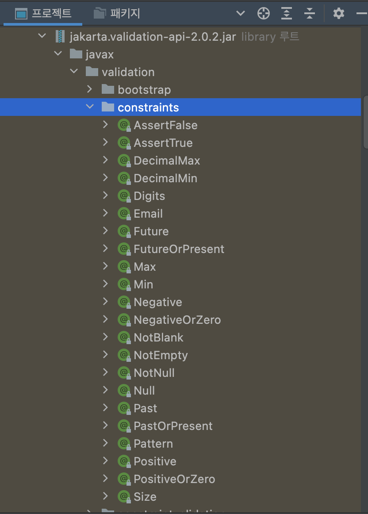
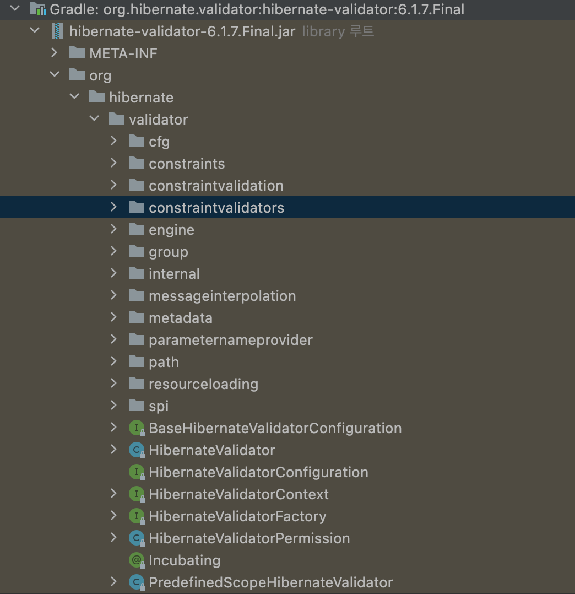
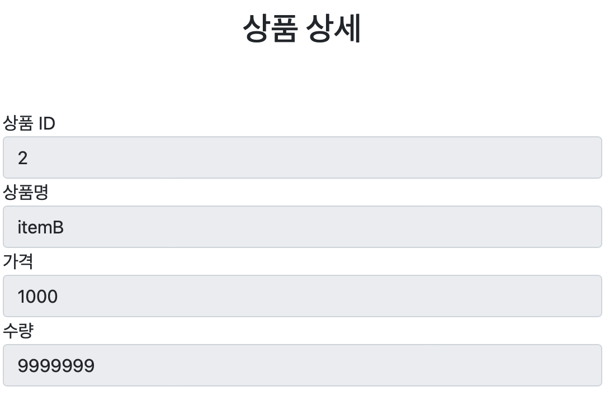
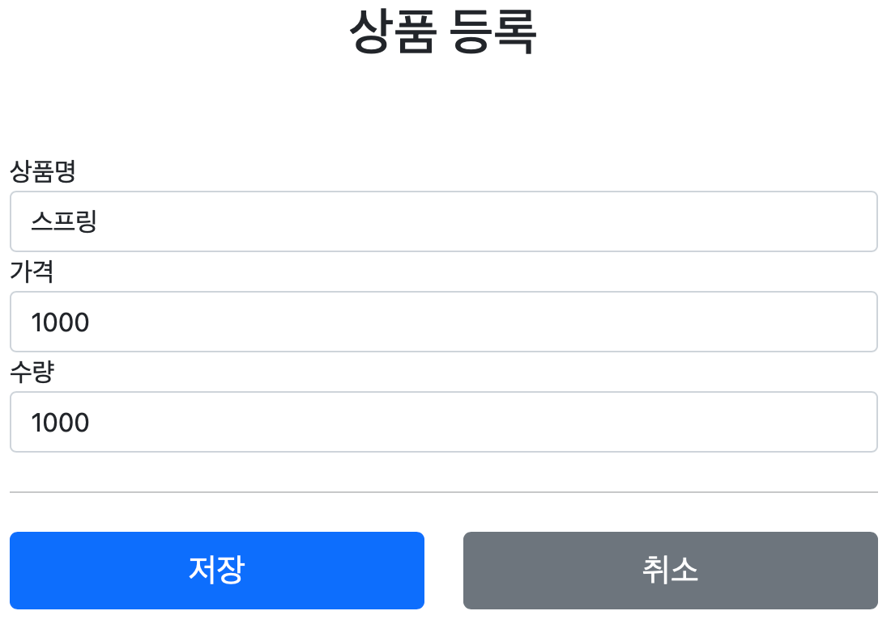

# 섹션 5. Bean Validation

## Bean Validation 소개
이전까지 진행했던 검증 로직이다. <br>
직접 Validator 인터페이스를 구현해서 컴포넌트를 등록하고 @InitBinder로 컨트롤러에 적용해야했다. <br> 
```
@Component
public class ItemValidator implements Validator {
    
    @Override
    public boolean supports(Class<?> clazz) {
        return Item.class.isAssignableFrom(clazz);
    }

    @Override
    public void validate(Object target, Errors errors) {
        Item item = (Item) target;

        if (!StringUtils.hasText(item.getItemName())) {
            errors.rejectValue("itemName", "required");
        }

        if (item.getPrice() == null || item.getPrice() < 1000 || item.getPrice() > 1000000) {
            errors.rejectValue("price", "range", new Object[]{1000, 1000000}, null);
        }

        if (item.getQuantity() == null || item.getQuantity() > 9999) {
            errors.rejectValue("quantity", "max", new Object[]{9999}, null);
        }

        if (item.getPrice() != null && item.getQuantity() != null) {
            int resultPrice = item.getPrice() * item.getQuantity();
            if (resultPrice < 10000) {
                errors.reject("totalPriceMin", new Object[]{10000, resultPrice}, null);
            }
        }
    }
}
```
지금까지 진행한 검증이 Item 하나뿐이지만 현업에서 수십, 수백개 객체의 검증이 필요하다면 객체마다 Validator 구현하는 것도 문제다. <br>  
또한 대부분의 검증 로직은 공백인지, 크기를 비교하는 등 매우 일반적인 로직이다. <br>
아래의 코드를 보자.
```
@Data
public class Item {

    private Long id;

    @NotBlank
    private String itemName;

    @NotNull
    @Range(min = 1000, max=1000000)
    private Integer price;

    @Max(9999)
    private Integer quantity;
    ...
}
```
복잡한 ItemVaildator와 다르게 Item 객체에 직접 어노테이션을 통해 무엇을 검증할 것인지 직관적인 표현을 했다. <br>
이런 검증 로직을 모든 프로젝트에 적용할 수 있게 공통화하고, 표준화 한 것이 바로 Bean Validation이다. <br>
이를 잘 활용하면, 매우 편하게 검증 로직을 적용할 수 있다.

#### Bean Validation이란?
Bean Validation 특정 구현체가 아니라 Bean Validation 2.0(JSR-380)이라는 기술 표준이다. <br>
간단히 검증 애노테이션과 여러 인터페이스의 모음이다.

Bean Validation을 구현한 기술중에 일반적으로 사용하는 구현체는 하이버네이트 Validator이다.
하이버네이트 이름 때문에 ORM과 연관지을 수 있지만 전혀 관계 없다.


#### 하이버네이트 Validator 관련 링크
- 공식 사이트 : http://hibernate.org/validator/
- 공식 메뉴얼: https://docs.jboss.org/hibernate/validator/6.2/reference/en-US/html_single/
- 검증 애노테이션 모음: https://docs.jboss.org/hibernate/validator/6.2/reference/en-US/html_single/#validator-defineconstraints-spec

## Bean Validation 시작
Bean validation을 사용하려면 build.gradle에 의존성을 추가한다.
```
implementation 'org.springframework.boot:spring-boot-starter-validation'
```

검증을 하고자하는 객체에 Bean Validation 애노테이션을 적용한다.  
```
@Data
public class Item {

    private Long id;

    @NotBlank
    private String itemName;

    @NotNull
    @Range(min = 1000, max=1000000)
    private Integer price;

    @Max(9999)
    private Integer quantity;
    ...
}
```
**검증 애노테이션**
- @NotBlank : 빈값 + 공백을 허용하지 않는다.
- @NotNull : null 허용하지 않는다.
- @Range(min=1000, max=1000000) : 범위 안의 값을 가져야한다.
- @Max(9999) : 최대 9999까지만 허용한다.

> **참고**
> 
> 검증 애노테이션 import를 확인해보자. 
> javax.validation.constraints.NotNull
> org.hibernate.validator.constraints.Range
> 
> javax.validation로 시작하면 특정 구현에 관계없이 제공되는 표준 인터페이스고,
> org.hibernate.validator로 시작하면 하이버네이트 validator 구현체를 사용할 때 제공되는 검증 기능이다.
> 현업에서 대부분 하이버네이트 validator를 사용해서 자유롭게 사용하면 된다.

#### 테스트 코드 작성 
```
class BeanValidationTest {

    @Test
    void beanValidation() throws Exception {
        ValidatorFactory validatorFactory = Validation.buildDefaultValidatorFactory();
        Validator validator = validatorFactory.getValidator();

        Item item = new Item();
        item.setItemName(" ");
        item.setPrice(0);
        item.setQuantity(10000);

        Set<ConstraintViolation<Item>> violations = validator.validate(item);
        for (ConstraintViolation<Item> violation : violations) {
            System.out.println("violation = " + violation);
            System.out.println("violation = " + violation.getMessage());
        }
    }
}
```
Validation.buildDefaultValidatorFactory를 통해 **검증기 생성**을 하는데, 이를 통해 검증 할 수 있다.

**검증 실행**은 단순하다. <br>
검증 대상을 validator.validate(item) 검증기에 넣고 결과를 받으면 되는데, Set<ConstraintViolation<검증대상객체>> 형태로 오류를 반환해준다. 비어있으면 오류가 없다고 보면된다. <br>
아래는 일부러 잘못된 값으로 검증기를 돌려서 반환된 오류 정보다.
```
violation = ConstraintViolationImpl{interpolatedMessage='1000에서 1000000 사이여야 합니다', propertyPath=price, rootBeanClass=class hello.itemservice.domain.item.Item, messageTemplate='{org.hibernate.validator.constraints.Range.message}'}
violation = 1000에서 1000000 사이여야 합니다
violation = ConstraintViolationImpl{interpolatedMessage='공백일 수 없습니다', propertyPath=itemName, rootBeanClass=class hello.itemservice.domain.item.Item, messageTemplate='{javax.validation.constraints.NotBlank.message}'}
violation = 공백일 수 없습니다
violation = ConstraintViolationImpl{interpolatedMessage='9999 이하여야 합니다', propertyPath=quantity, rootBeanClass=class hello.itemservice.domain.item.Item, messageTemplate='{javax.validation.constraints.Max.message}'}
violation = 9999 이하여야 합니다
```
ConstraintViolation 안에 다양한 정보가 담긴 것을 알 수 있다. 

 

## 스프링에 적용하기
#### 스프링 MVC는 어떻게 Bean Validation을 사용할까?
스프링 부트는 spring-boot-starter-validation 라이브러리를 넣으면 자동으로 Bean Validation을 인지하고 스프링에 통합한다.

#### 스프링 부트는 자동으로 글로벌 Validator 로 등록한다.
이전에 개발자가 직접 만든 ItemValidator를 글로벌 설정을 한적 있다.
```
@SpringBootApplication
public class ItemServiceApplication implements WebMvcConfigurer {

	public static void main(String[] args) {
		SpringApplication.run(ItemServiceApplication.class, args);
	}
    // 글로벌 설정 
	@Override
	public Validator getValidator() {
		return new ItemValidator();
	}
}
```
스프링 부트는 자동으로 LocalValidatorFactoryBean을 글로벌 Validator로 설정한다. <br>
이 Validator는 @NotNull 같은 애노테이션을 보고 검증을 수행한다. <br>
스프링 부트가 해준 자동 설정 덕분에 원하는 곳에 @Valid, @Validated 적용만하면 된다.

> 만약, 위 코드와 같이 수동으로 글로벌 설정을 했다면 
> 스프링 부트는 Bean Validator를 설정하지 않아서 애노테이션 기반 검증을 사용할 수 없다.

#### 검증 순서
1. @ModelAttribute 각각 필드의 타입 변환 시도
   1. 성공하면 다음으로
   2. 실패하면 typeMismatch로 FieldError 추가
2. Validator 적용

- String ItemName 에 문자 "A" 입력 -> 타입 변환 성공 -> 해당 필드에 Bean Validattion 적용
- int price 에 문자 "A" 입력 -> 타입 변환 실패 -> typeMismatch FieldError 추가

BeanValidator는 바인딩에 성공한 필드만 적용한다. 한마디로 실패한 바인딩은 대상으로 삼지 않는다.

## Bean Validation 에러 코드
이전까지 에러코드는 errors.message 파일이나 직접 하드코딩하면서 사용했다. <br>
그렇다면 Bean Validation이 사용하는 에러코드는 과연 무엇일까? <br>
Bean Validation 적용 후 검증 오류 코드를 출력해보자.
```
Field error in object 'item' on field 'itemName': rejected value []; codes [NotBlank.item.itemName,NotBlank.itemName,NotBlank.java.lang.String,NotBlank]; arguments [org.springframework.context.support.DefaultMessageSourceResolvable: codes [item.itemName,itemName]; arguments []; default message [itemName]]; default message [공백X]
```
적용한 @NotBlank 애노테이션 기반으로 오류 코드가 만들어지는걸 볼 수 있는데 typeMismatch와 비슷하다. <br>
이를 활용해서 errors.property에 Bean Validation 관련된 에러 메시지를 추가해본다.

```
#Bean Validation 추가
NotBlank={0} 공백X
Range={0}, {2} ~ {1} 허용
Max={0}, 최대 {1}
```
보통 {0} 필드명을 의미하고 {1}, {2}는 애노테이션마다 다른 의미를 가진다.

#### 메시지 찾는 순서
BeanValidation이 메시지 찾는 순서다.
1. 생성된 메시지 코드 순서대로 messageSource에서 찾기
2. 애노테이션의 message 속성 사용 : @NotBlank(message = "공백 {0}")
3. 라이브러리가 제공하는 기본 값 사용

## Bean Validation 오브젝트 오류
지금까지 Bean Validation은 특정 필드에서만 검증하고 오류를 처리했다. <br>
복합 룰 관련된 Object 오류는 어떻게 처리할까? <br>
@ScriptAssert()를 사용한다.

```
@ScriptAssert(lang = "javascript", script = "_this.price * _this.quantity >= 10000", message = "총합이 10,000원 넘게 입력해주세요.")
@Data
public class Item {
    ...
}
```
오브젝트 검증이 잘 작동되는 걸 볼 수 있다. 오류가 발생하면 이전과 마찬가지로 @ScriptAssert 오류 코드를 사용한다.
```
Error in object 'item': codes [ScriptAssert.item,ScriptAssert]; arguments [org.springframework.context.support.DefaultMessageSourceResolvable: codes [item.,]; arguments []; default message [],_this,javascript,,_this.price * _this.quantity >= 10000]; default message [10,000원 넘게 입력해주세요.]
```

사용된 @ScriptAssert의 속성을 보면 lang, script, message가 있다. <br>
- lang : 검증에 사용할 스크립트 언어 javascript, groovy를 선택한다.
- sciprt : 선택한 스크립트 언어로 검증 로직을 구현한다.
- message : 검증 실패 시 노출할 메시지를 정한다. 없으면 messageCodeResolver가 애노테이션 기반으로 생성한 에러 코드를 따른다.

그 외에도 여러 속성이 존재한다.

#### @ScriptAssert 검증은 비권장.
소제목 그대로 오브젝트 검증은 비권장한다. <br>
간단히 5개의 복합 룰이 있다고 생각해보자. 어떻게 검증해야할까? 답은 간단하다. <br>
검증 개수대로 @ScriptAssert를 사용한다.
```
@ScriptAssert(lang = "javascript", script = "_this.price * _this.quantity >= 10000", message = "총합이 10,000원 넘게 입력해주세요.")
@ScriptAssert(lang = "javascript", script = "_this.price * _this.quantity >= 10000", message = "총합이 10,000원 넘게 입력해주세요.")
@ScriptAssert(lang = "javascript", script = "_this.price * _this.quantity >= 10000", message = "총합이 10,000원 넘게 입력해주세요.")
@ScriptAssert(lang = "javascript", script = "_this.price * _this.quantity >= 10000", message = "총합이 10,000원 넘게 입력해주세요.")
@ScriptAssert(lang = "javascript", script = "_this.price * _this.quantity >= 10000", message = "총합이 10,000원 넘게 입력해주세요.")
@Data
public class Item {
    ...
}
```
필드의 경우 @NotNull, @Range, @Max 등 여러가지를 사용해도 직관적이고 간편했지만 <br>
오브젝트의 경우 @ScriptAssert를 선언할 수록 복잡성과 유지보수가 어려워진다. <br>
또한 검증 대상이 외부 API를 통해 데이터를 가져와서 검증할 경우엔 사용할 수도 없다. <br>
오브젝트(글로벌) 오류의 경우 직접 자바로 혼합해서 사용하는 걸 권장한다.

```
@PostMapping("/add")
public String addItem2(@Validated @ModelAttribute Item item, BindingResult bindingResult,
RedirectAttributes redirectAttributes) {
     // 복합 룰은 자바로 구현한다.
     if (item.getPrice() != null & item.getQuantity() != null) {
         int resultPrice = item.getPrice() * item.getQuantity();
         if (resultPrice < 10000) {
             bindingResult.reject("totalPriceMin", new Object[]{10000, resultPrice}, null);
         }
     }
   
     if (bindingResult.hasErrors()) {
         log.info("errors = {}", bindingResult);
         return "validation/v3/addForm";
     }
   
     Item savedItem = itemRepository.save(item);
     redirectAttributes.addAttribute("itemId", savedItem.getId());
     redirectAttributes.addAttribute("status", true);
     return "redirect:/validation/v3/items/{itemId}";
}
```

## Bean Validation 수정에 적용
이전까지는 상품 등록에 대해서 검증을 했지만, 이제 상품 수정에도 적용해보자. 상품 등록과 거의 흡사하다.
```
    @PostMapping("/{itemId}/edit")
    public String edit(@PathVariable Long itemId, @Validated @ModelAttribute Item item, BindingResult bindingResult) {
        if (item.getPrice() != null & item.getQuantity() != null) {
            int resultPrice = item.getPrice() * item.getQuantity();
            if (resultPrice < 10000) {
                bindingResult.reject("totalPriceMin", new Object[]{10000, resultPrice}, null);
            }
        }

        if (bindingResult.hasErrors()) {
            log.info("errors = {}", bindingResult);
            return "validation/v3/editForm";
        }

        itemRepository.update(itemId, item);
        return "redirect:/validation/v3/items/{itemId}";
    }  
```

## Bean Validation 한계
상품 등록과 상품 수정은 요구사항이 다른 경우가 많다.

####등록 시 기존 요구 사항####
   - 타입 검증  
     - 가격, 수량에 문자가 들어가면 검증 오류 처리
   - 필드 검증
     - 상품명 : 필수, 공백 X
     - 가격 : 1000원 이상, 1백만원 이하
     - 수량 : 최대 9999
   - 복합 검증
     - 가격 * 수량의 합은 10,000원 이상

####수정 시 요구사항 ####
- quantity 수량을 무제한으로 변경할 수 있다.
- id 값이 필수다.

수정 요구사항에 맞게 Item을 변경해보자.
```
@Data
public class Item {

      @NotNull // 수정 요구사항 - id는 필수.
      private Long id;

      @NotBlank
      private String itemName;

      @NotNull
      @Range(min = 1000, max=1000000)
      private Integer price;

      @NotNull  
      //@Max(9999) //수정 요구사항 - 수량 제한 없어짐.
      private Integer quantity;
      
}
```

> **참고 사항** <br>
> 상품 수정 시 ID 값은 들어있도록 구성되어 있다보니 검증하지 않아도 된다고 생각할 수 있다. (이런 생각을 하는 케이스가 많다.) <br>
> 그런데 HTTP 요청은 악의적으로 변경하는 게 쉽기 때문에 서버에서 항상 검증하는게 안전하다.

수정 요구사항에 맞게 변경된 사항으로 실행시켜보면 수량이 제한없이 입력된 값으로 저장되는 걸 볼 수 있다.


하지만 상품 등록에서 문제가 생긴다. 아무리 저장을 눌러도 변화가 없다. 

```
Field error in object 'item' on field 'id': rejected value [null]; codes [NotNull.item.id,NotNull.id,NotNull.java.lang.Long,NotNull]; arguments [org.springframework.context.support.DefaultMessageSourceResolvable: codes [item.id,id]; arguments []; default message [id]]; default message [널이어서는 안됩니다]
```
로그를 확인해보면 상품 등록 시에 존재하지 않는 id 값이 없다고 에러가 뜨면서 등록이 안된다. <br>
또한 등록 시 요구사항인 상품 수량 9999개 제한이 없어진다.

Item 하나로 등록과 수정 둘 다 사용해서 요구사항이 충돌이 난거다.

## Bean Validation groups
Bean Validation은 충돌 상황을 처리하기 위해 groups 기능을 제공한다. <br>
groups는 상황(등록, 수정)에 따라 Bean Validation을 다르게 적용시켜준다.

groups를 사용하려면 구분하기 위한 인터페이스를 선언해야한다. <br>
다음은 저장과 수정을 구분하기 위한 인터페이스다.
```
public interface SaveCheck {}

public interface UpdateCheck {}
```

이제 상황에 맞게 구분해보자.
```
@Data
public class Item {
      
      @NotNull(groups = UpdateCheck.class) //수정시에만 적용 
      private Long id;
      
      @NotBlank(groups = {SaveCheck.class, UpdateCheck.class})
      private String itemName;
      
      @NotNull(groups = {SaveCheck.class, UpdateCheck.class})
      @Range(min = 1000, max = 1000000, groups = {SaveCheck.class,UpdateCheck.class})
      private Integer price;
      
      @NotNull(groups = {SaveCheck.class, UpdateCheck.class})
      @Max(value = 9999, groups = SaveCheck.class) //등록시에만 적용 private Integer quantity;
      private Integer quantity;
      
      ...    
```
이제 마지막으로 컨트롤러의 저장 로직과 수정 로직의 @Validated에 groups를 지정해주면 된다. 
```
@PostMapping("/add")
public String addV2(@Validated(SaveCheck.class) @ModelAttribute Item item, BindingResult bindingResult, RedirectAttributes redirectAttributes) {
    //...
}

@PostMapping("/{itemId}/edit")
public String editV2(@PathVariable Long itemId, @Validated(UpdateCheck.class) @ModelAttribute Item item, BindingResult bindingResult) {
    //...
}
```

> 참고로 @Valid에는 groups 기능이 없다.

이제 상품 등록과 상품 수정이 둘 다 정상적으로 동작하는 것을 확인할 수 있다 <br>

#### groups 기능은 비권장한다.
등록과 수정 2가지 상황을 groups로 구분했을 뿐인데 복잡도가 한눈에 보일 정도로 생겼다. <br>
실무에 들어가면 Item은 결제, 즐겨찾기, 장바구니 등등 다양한 검증이 생기는데 이 모든걸 groups로 구분하기엔 난감한 상황이 예상된다. <br>

원인은 간단하다 Item 하나로 여러가지 상황에 모두 사용하기 때문이다.

## Form 전송 객체 분리 - 소개
실무에서 Bean Validation의 groups 기능을 사용하지 않는다. <br>
그 이유는 상황에 따라 전송하는 데이터가 다르기 때문이다. 예제의 Item은 단순해서 와닿지 않을 수 있지만, 실무에서는 다양한 부가 데이터가 같이 날라온다. <br>
이런 다양한 데이터를 모두 Item 하나로 구현하려면 복잡도와 유지보수가 어려워지고 사이드 이펙트 발생이 쉬워진다. <br>
그래서 실무에서는 각 상황에 맞는 객체를 사용한다.
- 상품 등록 : ItemSaveForm
- 상품 수정 : ItemUpdateForm

1. 폼 데이터 전달에 Item 도메인 객체 하나만 사용
- 장점 : Item 도메인 객체가 모든 계층에 사용되서 편리하다.
- 단점 : 매우 간단한 경우에만 가능하고, 요구사항 변경 시 문제가 생기기 쉽다. 

2. 폼 데이터 전달을 위한 별도의 객체 사용
- 장점 : 폼에 맞춘 별도의 객체로 데이터를 받기 때문에, 등록과 수정의 검증이 충돌되는 상황이 없어진다.
- 단점 : 컨트롤러에서 Item 객체로 변환하는 과정이 생긴다. (회사마다 룰이 다를 수 있다.)

> **참고** <br>
> 폼 객체의 이름을 DTO, Request, Form 등 다양하게 선택할 수 있는데 가이드가 있다면 가이드를 따르고, 일관성있게 가면 된다.
> 
> 또한, 여러 상황을 Item 객체로 다 사용해도 되지 않을까 생각할 수 있는데, 유지보수가 어려워진다. 

## Form 전송 객체 분리 - 개발 
등록과 수정을 위한 객체를 따로 생성하고 검증하기 때문에 기존 Item의 검증은 모두 제거한다.
```
@Data
public class Item {

    private Long id;
    private String itemName;
    private Integer price;
    private Integer quantity;
}
```
상품 등록에 쓰이는 저장 폼이다.
```
@Data
public class ItemSaveForm {

    @NotBlank
    private String itemName;

    @NotNull
    @Range(min = 1000, max = 1000000)
    private Integer price;

    @NotNull
    @Max(9999)
    private Integer quantity;
}
```
상품 수정에 쓰이는 수정 폼이다.
```
@Data
public class ItemUpdateForm {

    @NotNull
    private Long id;

    @NotBlank
    private String itemName;

    @NotNull
    @Range(min = 1000, max = 1000000)
    private Integer price;

    private Integer quantity;    
}
```
이제 등록폼과 수정폼을 컨트롤러의 Item 대신 교체하고, 검증이 끝나면 Item으로 변환하는 과정을 추가한다.
```
@PostMapping("/add")
public String addItem2(@Validated @ModelAttribute("item") ItemSaveForm form, BindingResult bindingResult,
                           RedirectAttributes redirectAttributes) {
    if (form.getPrice() != null & form.getQuantity() != null) {
        int resultPrice = form.getPrice() * form.getQuantity();
        if (resultPrice < 10000) {
            bindingResult.reject("totalPriceMin", new Object[]{10000, resultPrice}, null);
        }
    }

    if (bindingResult.hasErrors()) {
        log.info("errors = {}", bindingResult);
        return "validation/v4/editForm";
    }
    
    // 받아온 폼을 Item으로 변환
    Item item = new Item();
    item.setItemName(form.getItemName());
    item.setPrice(form.getPrice());
    item.setQuantity(form.getQuantity());

    itemRepository.update(itemId, item);
    return "redirect:/validation/v4/items/{itemId}";
}

@PostMapping("/{itemId}/edit")
public String edit2(@PathVariable Long itemId, @Validated @ModelAttribute("item") ItemUpdateForm form, BindingResult bindingResult) {
    if (form.getPrice() != null & form.getQuantity() != null) {
        int resultPrice = form.getPrice() * form.getQuantity();
        if (resultPrice < 10000) {
            bindingResult.reject("totalPriceMin", new Object[]{10000, resultPrice}, null);
        }
    }

    if (bindingResult.hasErrors()) {
        log.info("errors = {}", bindingResult);
        return "validation/v4/editForm";
    }
     
    // 받아온 폼을 Item으로 변환
    Item item = new Item();
    item.setItemName(form.getItemName());
    item.setPrice(form.getPrice());
    item.setQuantity(form.getQuantity());

    itemRepository.update(itemId, item);
    return "redirect:/validation/v4/items/{itemId}";
}
```
이제 실행하면 등록과 수정이 정상적으로 되는걸 볼 수 있다. <br>
폼을 분리해서 상황에 맞게 기능을 구성하고 검증도 명확히 분리가 되었다. 

> **주의사항** <br>
> @ModelAttribute("item")으로 명시했는데, 뷰 템플릿을 보면 th:object="${item}"으로 사용하고 있기 때문이다. <br>
> 이를 원치 않으면 해당되는 폼으로 명칭을 변경하면 된다. 

## Bean Vaildation - HTTP 메시지 컨버터
@Valid, @Validated는 HttpMessageConvertor(@RequestBody)에도 적용이 된다. <br>
- @ModelAttribute는 HTTP 요청 파라미터(URL 쿼리 스트링, POST Form)를 다룬다.
- @RequestBody는 HTTP Body의 데이터를 객체로 변환할 때 사용한다. 주로 API JSON 요청할 때 사용한다.

@RequestBody를 사용할 간단한 API 컨트롤러를 만들어보자.
```
@Slf4j
@RestController
@RequestMapping("/validation/api/items")
public class VaildationItemApiController {

    @PostMapping("/add")
    public Object addItem(@RequestBody @Validated ItemSaveForm form, BindingResult bindingResult) {
        log.info("API 컨트롤러 호출");

        if (bindingResult.hasErrors()) {
            log.info("검증 오류 발생 errors = {}", bindingResult);
            return bindingResult.getAllErrors();
        }

        log.info("성공 로직 실행");
        return form;
    }
}
```
이제 테스트를 진행해야하는데 <br>
API 테스트를 만든다면 3가지 유형을 생각해야 한다.
1. 성공 요청 : 성공
2. 실패 요청 : JSON을 객체로 생성하는 것 자체가 실패 ex)타입 변환 오류
3. 검증 오류 요청 : JSON을 객체로 생성하는 건 성공, 검증에서 실패함.

API 테스트 방법은 여러가지가 있겠지만, 인텔리제이의 .http를 사용해 테스트를 진행한다. (인텔리제이가 아니라면 Postman을 추천한다.) <br>
```
### 성공적인 요청
POST http://localhost:8080/validation/api/items/add
Content-Type: application/json

{
  "itemName" : "스프링",
  "price" : 1000,
  "quantity" : 1000
}

### 실패하는 요청 - 타입오류
POST http://localhost:8080/validation/api/items/add
Content-Type: application/json

{
  "itemName" : "",
  "price" : "스프링",
  "quantity" : 10
}

### 실패하는 요청 - 공백, 잘못된 숫자
POST http://localhost:8080/validation/api/items/add
Content-Type: application/json

{
  "itemName" : "",
  "price" : 100,
  "quantity" : 10
}
```
순서대로 테스트를 실행해보자. 
```
### 성공적인 요청
HTTP/1.1 200
Content-Type: application/json
Transfer-Encoding: chunked
Date: Fri, 11 Aug 2023 14:16:35 GMT
Keep-Alive: timeout=60
Connection: keep-alive

{
  "itemName": "스프링",
  "price": 1000,
  "quantity": 1000
}
```
성공하는 테스트는 검증을 통한 값을 그대로 돌려받았다. 실제로 저장 로직이 없기 때문에 id는 없다.

```
### 실패하는 요청 - 타입오류
HTTP/1.1 400 
Content-Type: application/json
Transfer-Encoding: chunked
Date: Fri, 11 Aug 2023 14:18:28 GMT
Connection: close

{
  "timestamp": "2023-08-11T14:18:28.877+00:00",
  "status": 400,
  "error": "Bad Request",
  "message": "",
  "path": "/validation/api/items/add"
}

### 실패 요청 로그
2023-08-11 23:18:28.876  WARN 2951 --- [io-8080-exec-10] .w.s.m.s.DefaultHandlerExceptionResolver : Resolved [org.springframework.http.converter.HttpMessageNotReadableException: JSON parse error: Cannot deserialize value of type `java.lang.Integer` from String "스프링": not a valid Integer value; nested exception is com.fasterxml.jackson.databind.exc.InvalidFormatException: Cannot deserialize value of type `java.lang.Integer` from String "스프링": not a valid Integer value
```
타입 오류를 통한 실패 요청은 400 를 받았다. <br>
HttpMessageConvertor가 요청 JSON을 ItemSaveForm 객체로 생성하는 과정이 실패했다. <br>
Integer 타입에 "스프링" 문자가 왔기 때문이다. <br> 
이 경우 ItemSaveForm 객체를 만들지 못하기 때문에 컨트롤러 자체가 호출이 안되고 예외가 발생한다. 객체가 없기 때문에 Validator도 실행되지 않는다.

```
HTTP/1.1 200 
Content-Type: application/json
Transfer-Encoding: chunked
Date: Fri, 11 Aug 2023 14:18:25 GMT
Keep-Alive: timeout=60
Connection: keep-alive

[
  {
    "codes": [
      "NotBlank.itemSaveForm.itemName",
      "NotBlank.itemName",
      "NotBlank.java.lang.String",
      "NotBlank"
    ],
    "arguments": [
      {
        "codes": [
          "itemSaveForm.itemName",
          "itemName"
        ],
        "arguments": null,
        "defaultMessage": "itemName",
        "code": "itemName"
      }
    ],
    "defaultMessage": "공백일 수 없습니다",
    "objectName": "itemSaveForm",
    "field": "itemName",
    "rejectedValue": "",
    "bindingFailure": false,
    "code": "NotBlank"
  },
  {
    "codes": [
      "Range.itemSaveForm.price",
      "Range.price",
      "Range.java.lang.Integer",
      "Range"
    ],
    "arguments": [
      {
        "codes": [
          "itemSaveForm.price",
          "price"
        ],
        "arguments": null,
        "defaultMessage": "price",
        "code": "price"
      },
      1000000,
      1000
    ],
    "defaultMessage": "1000에서 1000000 사이여야 합니다",
    "objectName": "itemSaveForm",
    "field": "price",
    "rejectedValue": 100,
    "bindingFailure": false,
    "code": "Range"
  }
]

### 실패 요청 로그
2023-08-11 23:19:30.876  INFO 1505 --- [nio-8080-exec-1] h.i.w.v.VaildationItemApiController      : API 컨트롤러 호출
2023-08-11 23:19:30.877  INFO 1505 --- [nio-8080-exec-1] h.i.w.v.VaildationItemApiController      : 검증 오류 발생 errors = org.springframework.validation.BeanPropertyBindingResult: 2 errors
Field error in object 'itemSaveForm' on field 'itemName': rejected value []; codes [NotBlank.itemSaveForm.itemName,NotBlank.itemName,NotBlank.java.lang.String,NotBlank]; arguments [org.springframework.context.support.DefaultMessageSourceResolvable: codes [itemSaveForm.itemName,itemName]; arguments []; default message [itemName]]; default message [공백일 수 없습니다]
Field error in object 'itemSaveForm' on field 'price': rejected value [100]; codes [Range.itemSaveForm.price,Range.price,Range.java.lang.Integer,Range]; arguments [org.springframework.context.support.DefaultMessageSourceResolvable: codes [itemSaveForm.price,price]; arguments []; default message [price],1000000,1000]; default message [1000에서 1000000 사이여야 합니다]
```
검증 실패 테스트의 반환값은 스프링이 BindResult.getAllErrors()의 결과를 Json 형태로 보내준다. <br>
getAllErrors()는 ObjectError와 FieldError를 반환한다. <br>
로그를 보면 검증 오류가 수행되는 걸 알 수 있다. <br>
단, 실무에서는 이렇게 반환하지 않고 필요한 정보만 추려서 반환하는게 좋다.

#### @ModelAttribute vs @RequestBody
컨트롤러가 호출되기 전에 타입 에러가 발생하면 서로 결과가 달랐다. 이유가 뭘까? <br>
- @ModelAttribute
  - 스프링이 객체의 필드 단위로 바인딩을 진행한다. 오류가 발생해도 다른 필드는 정상적으로 바인딩된다. 스프링이 BindingResult에 오류를 넣어주기 때문에 컨트롤러가 호출이 된다.
- @RequestBody
  - HttpMessageConverter는 필드 단위가 아니라 객체 단위로 적용한다. 실패하면 객체가 생성되지 않기 예외가 발생하고 컨트롤러가 호출이 되지 않아 Validator 적용도 안된다.

 


