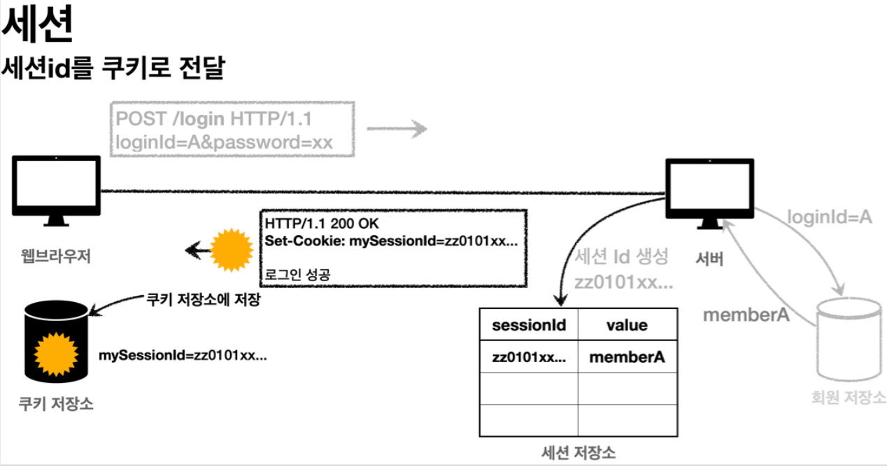

# 섹션 6. 로그인 처리1 - 쿠키, 세션

#### 패지키 구조 설계
- hello.login
  - domain
    - item
    - member
    - login
  - web
    - item
    - member
    - login

#### 도메인이 가장 중요하다
도메인 = 화면, UI, 기술 인프라 등의 영역을 제외한 시스템이 구현해야 하는 핵심 비즈니스 업무 영역을 말함.

향후 web을 다른 기술로 바꾸어도 domain은 그대로 유지할 수 있어야 한다.
web은 doamin을 의존하면서 domain은 web을 모르게(의존하지않는다) 설계해야한다.

> 의존성은 클린 아키텍처를 참고하면 좋다. 
> 


## 로그인 처리 - 쿠키
로그인을 위한 회원 도메인 관련된 코드는 이전의 Item 예제와 흡사하니 생략하고 넘어간다. 자세한 코드는 member 도메인 참고. <br>

#### 로그인 상태 유지하기 
사용자가 로그인을 하면 로그인 상태를 어떻게 유지할까? 매번 요청과 응답에 로그인 정보를 담아서 보낼까? 이는 매우 어렵고 번거로운 작업이다. 쿠키를 이용하면 간단해진다.

#### 쿠키
로그인 성공이 되면, HTTP 응답에 쿠키를 담아서 브라우저에 전달한다. 그러면 브라우저는 해당 쿠키를 계속 보내준다.

- 쿠키 생성

- 쿠키 전달

- 쿠키 전달 2


#### 쿠키에는 영속 쿠키와 세션 쿠키가 있다.
- 영속 쿠키 : 만료 날짜를 입력하면 해당 날짜까지 유지
- 세션 쿠키 : 만료 날짜를 생략하면 브라우저 종료까지만 유지

대부분의 사용자는 로그아웃을 대신 브라우저를 종료하기 때문에, 세션 쿠키가 적합하다.

#### 로그인 기능
```
private static final String COOKIE_MEMBER_ID = "memberId";

@PostMapping("/login")
public String login(@Valid @ModelAttribute LoginForm form, BindingResult bindingResult,
                    HttpServletResponse response) {
    if (bindingResult.hasErrors()) {
        return "login/loginForm";
    }

    Member loginMember = loginService.login(form.getLoginId(), form.getPassword());

    if (loginMember == null) {
        bindingResult.reject("loginFail", "아이디 또는 비밀번호가 다릅니다.");
        return "login/loginForm";
    }

    // 로그인 성공 처리
    // 쿠키에 시간 정보를 주지 않으면 세션 쿠키(브라우저 종료시 모두 종료)
    Cookie idCookie = new Cookie(COOKIE_MEMBER_ID, String.valueOf(loginMember.getId()));
    response.addCookie(idCookie);

    return "redirect:/";
}
```
로그인 성공하면 쿠키를 생성하고 HttpServletResponse에 담는다. 쿠키 이름은 memberId이고, 값은 회원의 id를 담아 브라우저에 전달한다. <br>


브라우저는 종료전까지 쿠키에 저장된 회원의 id를 요청마다 서버에 계속 보내준다.


#### 로그아웃 기능
로그아웃은 단순하다. 로그인 쿠키의 수명시간을 0초로 설정하고 보내면 쿠키는 종료된다.
```
@PostMapping("/logout")
public String logout(HttpServletResponse response) {
    expireCookie(response, COOKIE_MEMBER_ID);
    return "redirect:/";
}

private void expireCookie(HttpServletResponse response, String cookieName) {
    Cookie cookie = new Cookie(cookieName, null);
    cookie.setMaxAge(0);
    response.addCookie(cookie);
}
```

## 쿠키와 보안 문제
지금까지 쿠키로 로그인 구현은 문제없이 되었다. 하지만 이 방법엔 심각한 보안 문제가 있다.

#### 보안 문제
- 쿠키의 값은 임의로 변경할 수 있다.
  - 클라이언트가 쿠키를 변경하면 다른 사용자가 된다. 
    - memberId=1 -> memberId=2 다른 사용자로 변경됨. 
  - 브라우저마다 개발자 모드로 쉽게 확인되고 변경된다. 
- 쿠키에 보관된 정보는 훔쳐가기 쉽다.
  - 쿠키에 개인 정보나 신용카드 정보가 저장된다면? 
    - 브라우저에 저장되어, 네트워크 요청마다 서버로 전달된다.
    - 쿠키의 정보를 로컬 PC나 네트워크 전송 구간에서 털릴 수 있다.
- 해커가 쿠키를 훔쳐가면 평생 악용될 수 있다.
  - 쿠키 값을 이용해 악의적인 요청을 계속할 수 있다.


#### 대안
- 쿠키에 민감한 정보(개인정보, 신용카드 등)를 노출하지 않고, 예측 불가능한 임의의 토큰(랜덤 값)을 노출한다. 서버는 토큰과 사용자 id를 매핑해서 인식하고 서버에서 토큰을 관리한다.
- 토큰은 해커가 임의의 값을 넣어도 못찾게 예상 불가능해야한다. (값에 규칙이 없어야한다)
- 토큰이 악용될 수 없게 만료시간을 짧게(예:30분) 유지한다. 만약 토큰이 탈취되어 해킹이 의심되면 서버에서 강제로 해당 토큰을 제거하면 끝난다.

## 로그인 처리 - 세션 동작 방식
쿠키는 중요 정보가 노출되는 보안 문제가 있다. 이를 해결하려면 결국 중요 정보를 서버에 저장하고, 이를 연결하는 값은 식별이 불가능한 임의의 값으로 처리해야한다. <br>
서버에서 중요 정보를 저장하고 연결하는 방법을 **세션**이라 한다.


1. 사용자가 로그인 시도하면 서버에서 해당 사용자가 맞는지 확인한다.


2. 로그인 성공하면 세션 ID를 생성한다.
  - 세션 ID는 추정 불가능한 값이여야 한다. UUID를 추천한다.
    - Cookie: mySessionId=zz0101xx-bab9-4b92-9b32-dadb280f4b61
  - 생성된 세션 ID와 세션에 보관할 값을 서버의 세션 저장소에 보관한다.


3. 세션 ID을 응답 쿠키로 전달한다.
  - **세션을 사용해도 클라이언트와 서버를 연결하는건 쿠키다.**
    - 서버는 클라이언트에 mySessionId라는 이름으로 세션 ID 쿠키로 전달한다.
    - 클라이언트는 쿠키 저장소에 mySessionId 쿠키를 보관한다.


4. 클라이언트의 쿠키에 저장된 세션 ID 전달.
   - 클라이언트는 요청마다 mySessionId 쿠키를 전달한다.
   - 서버는 mySessionId 쿠키 정보로 세션 정보를 조회한다.

#### 쿠키의 보안 문제 해결.
세션을 활용해서 서버에 중요 정보를 보관하게 되었다. 이를 통해 쿠키의 보안 문제를 해결했다.
1. 브라우저를 통해 쿠키 값을 변조 가능 -> 예상 불가능한 값을 세션 id로 사용
2. 쿠키의 값은 클라이언트 해킹 시 유출될 수 있다 -> 쿠키엔 세션 id만 저장되고 중요정보는 없다.
3. 탈취된 쿠키 악용 -> 서버의 짧은 만료시간으로 금방 종료된다. 해킹이 의심되면 서버에서 해당 세션 삭제가 가능하다. 

## 로그인 처리 - 세션 직접 만들어보기
세션의 동작을 직접 구현해보자. 3가지 기능을 제공하면 된다.

1. 세션 생성 
   - sessionId는 추정 불가능한 랜덤 값이다.
   - 세션 저장소에 sessionId, 보관할 값을 저장한다. (key, value 형식) 
   - 생성한 쿠키에 sessionId를 담아 클라이언트에 응답을 보낸다.
2. 세션 조회
   - 클라이언트는 쿠키에 저장된 sessionId 값을 매번 요청에 담는다. 세션 저장소에 조회한다. 
3. 세션 만료
   - 클라이언트가 보낸 sessionId 값으로 세션 저장소의 보관한 값을 삭제한다.

```
@Slf4j
@Component
public class SessionManager {

    public static final String SESSION_COOKIE_NAME = "mySessionId";
    private Map<String, Object> sessionStore = new ConcurrentHashMap<>();

    /**
     * 세션 생성
     */
    public void createSession(Object value, HttpServletResponse response) {

        String sessionId = UUID.randomUUID().toString();
        sessionStore.put(sessionId, value);

        Cookie mySessionCookie = new Cookie(SESSION_COOKIE_NAME, sessionId);
        response.addCookie(mySessionCookie);
    }

    /**
     * 세션 조회
     */
    public Object getSession(HttpServletRequest request) {
        Cookie sessionCookie = findCookie(request, SESSION_COOKIE_NAME);
        if (sessionCookie == null) {
            return null;
        }
        log.info("sessionCookie = {}, sessionStore = ${}", sessionCookie.getValue(), sessionStore.get(sessionCookie.getValue()));
        return sessionStore.get(sessionCookie.getValue());
    }

    /**
     * 세션 만료
     */
    public void expire(HttpServletRequest request) {
        Cookie sessionCookie = findCookie(request, SESSION_COOKIE_NAME);
        if (sessionCookie != null) {
            sessionStore.remove(sessionCookie.getValue());
        }
    }

    private Cookie findCookie(HttpServletRequest request, String cookieName) {
        if (request.getCookies() == null) {
            return null;
        }

        return Arrays.stream(request.getCookies())
                .filter(c -> c.getName().equals(cookieName))
                .findAny()
                .orElse(null);
    }
}
```
로그인을 해보면 브라우저에 저장된 쿠키 값을 확인할 수 있다. 


로그인 상태에서 요청을 하면 쿠키의 mySessionId로 세션에 저장된 값을 조회해온다. 
```
sessionCookie = e326c4db-5f1c-4fa4-995a-315bb8aeb6fa, sessionStore = Member(id=1, loginId=test, name=스프링하이, password=test!)
```

로그아웃은 단순하다 저장된 세션의 값을 지우면 끝난다. 이후 같은 값으로 조회해도 저장된 값이 없다고 나온다. 
``` 
sessionCookie = e326c4db-5f1c-4fa4-995a-315bb8aeb6fa, sessionStore = null
```

#### 문제점
사용자가 로그아웃을 안하고 브라우저를 종료하면 세션의 값이 계속 유지된다. <br>
세션에 저장된 값이 계속 누적되다보면 서버 과부화가 생긴다.

#### 정리
쿠키와 세션의 차이는 데이터 저장 장소가 클라이언트나 서버나 차이일뿐이다. <br>
다만 클라이언트에서 세션 저장소의 값을 조회하기 위해선 쿠키에 해당 값을 저장할뿐이다. <br> 

예제처럼 세션 저장소를 매번 구현하는 건 아니다. 서블릿이 세션 개념을 지원한다.

## 로그인 처리 - 서블릿 HTTP 세션
세션 개념은 대부분의 웹 애플리케이션에 필요하다. <br>
서블릿은 HttpSession 기능을 제공하는데, 지금까지 언급된 문제들을 해결하고 더 나은 기능을 제공한다. <br>
HttpSevletRequest에 HttpSession이 있는걸 알 수 있다. 


서블릿이 제공하는 HttpSession도 이전에 만들었던 SessionManage와 같은 방식으로 동작한다.

```
@PostMapping("/login")
public String loginV3(@Valid @ModelAttribute LoginForm form, BindingResult bindingResult,
                      HttpServletRequest request) {
    if (bindingResult.hasErrors()) {
        return "login/loginForm";
    }

    Member loginMember = loginService.login(form.getLoginId(), form.getPassword());
    if (loginMember == null) {
        bindingResult.reject("loginFail", "아이디 또는 비밀번호가 다릅니다.");
        return "login/loginForm";
    }

    // 로그인 성공 처리
    request.getSession().setAttribute(SessionConst.LOGIN_MEMBER, loginMember);

    return "redirect:/";
}
@GetMapping("/")
public String homeLoginV3(HttpServletRequest request, Model model) {

    // 세션 관리자에 저장된 회원 정보 조회
    HttpSession session = request.getSession(false);

    // 로그인
    if (session == null) {
        return "home";
    }
    
    ... (생략)
}
```

사용 방법도 단순하다. HttpServletRequest에서 세션을 생성하면 다음과 같은 쿠키가 생성된다. <br>
쿠키 이름은 JSESSIONID 이고 값은 추정 불가능한 값이다.


#### 세션 생성과 조회
- 세션 생성 : request.getSession(true)를 사용한다.

boolean create 옵션은 다음과 같다.
1. request.getSession(true)
- 세션이 있으면 기존 세션을 반환한다.
- 세션이 없으면 새로운 세션을 생성해서 반환한다.

2. request.getSession(false)
- 세션이 있으면 기존 세션을 반환한다.
- 세션이 없으면 null을 반환한다. 

request.getSession()로 호출하면 default로 true로 실행된다. <br>

#### 세션 저장 및 삭제
- 정보 보관 : session.setAttribute(key, value)으로 사용한다. 여러가지 저장이 된다.
- 정보 삭제 : session.removeAttribute(key)로 저장소의 값을 지운다.


#### 세션 삭제
저장소에 저장된 값이 아닌 세션 자체를 지우는 방법이다. 
- session.invalidate() 

#### 참고
세션을 사용할 때 로그인을 안해도 확인하는 과정이 있을것이다. <br>
이 경우엔 request.getSession(false)를 사용한다. 로그인 된 사용자가 없으면 무의미한 세션이 생성된다.

```
@GetMapping("/")
public String homeLoginV3(HttpServletRequest request, Model model) {

    // 세션 관리자에 저장된 회원 정보 조회
    HttpSession session = request.getSession(false);

    // 로그인
    if (session == null) {
        return "home";
    }

    Member loginMember = (Member) session.getAttribute(SessionConst.LOGIN_MEMBER);

    if (loginMember == null) {
        return "home";
    }

    model.addAttribute("member", loginMember);
    return "loginHome";
}
```

## 로그인 처리 - 서블릿 HTTP 세션2
스프링은 세션을 편리하게 사용할 수 있도록 @SessionAttribute를 지원한다. <br>

이를 활용하면 편리하게 세션의 값을 바인딩할 수 있다.

```
@GetMapping("/")
public String homeLoginV3Spring(@SessionAttribute(name = SessionConst.LOGIN_MEMBER, required = false) Member loginMember, Model model) {

    if (loginMember == null) {
        return "home";
    }

    model.addAttribute("member", loginMember);
    return "loginHome";
}
```
이전까지 매번 반복되던 HttpSession session = request.getSession(false) 과정이 사라지고 단순하게 로직이 변경되었다. <br>

@SessionAttribute의 각 속성을 알아보자
- name : 세션 저장소에 조회해올 값을 지정한다.
- required : 세션을 생성할 것인지 여부를 묻는다. false로 사용하는게 좋다.
  - required=true로 되어있을 경우 세션이 없는데 조회하려다 null 에러가 발생할 수 있다.
```
Resolved [org.springframework.web.bind.ServletRequestBindingException: Missing session attribute 'loginMember' of type Member]
```

#### TrackingModes
브라우저마다 다르지만, 로그인을 처음 시도하면 URL에 jssesionid가 포함될 수 있다.

웹 브라우저가 쿠키를 지원안하면 쿠키 대신 URL을 통해서 세션을 유지하는 방법이다. <br>
타임리프 템플릿 엔진을 통해서 링크를 걸면 URL에 자동으로 포함해준다. <br>
서버 입장에서는 브라우저가 쿠키를 지원안하는 지 모르기 때문에 쿠키 값과 URL 둘 다 전달한다. <br>

URL 전달 방식을 종료하려면 application.property에 설정을 추가하면 된다.
- server.servlet.session.tracking-modes=cookie

## 세션 정보와 타임아웃 설정
세션은 여러가지 정보를 제공한다.

```
@GetMapping("/session-info")
public String sessionInfo(HttpServletRequest request) {
    HttpSession session = request.getSession(false);
    if (session == null) {
        return "세션이 없습니다.";
    }

    // 세션 데이터 출력
    session.getAttributeNames().asIterator()
            .forEachRemaining(name -> log.info("session name = {}, value = {}", name, session.getAttribute(name)));

    log.info("sessinoId={}", session.getId());
    log.info("getMaxInactiveInterval={}", session.getMaxInactiveInterval());
    log.info("getCreationTime={}", new Date(session.getCreationTime()));
    log.info("getLastAccessedTime={}", new Date(session.getLastAccessedTime()));
    log.info("isNew={}", session.isNew());

    return "세션 출력";
}
```

- sessinoId : JSESSIONID 값이다
- maxInactiveInterval : 세션의 유효시간이다. 1800(30분)
- creationTime : 세션의 생성일시다.
- lastAccessedTime : 사용자가 최근 세션에 접근한 시간이다. 접근할 때 갱신된다.
- isNew : 새로 생성된 세션인지, 과거에 생성되어 조회된 세션인지 구분한다.

#### 세션 타임아웃 설정
대부분의 사용자는 로그아웃을 직접하지 않고 브라우저를 종료한다. <br>
문제는 서버는 사용자가 브라우저 종료를 인식할 수 없어서 삭제여부를 알 수 없다

#### 세션의 종료 시점
그럼에도 불구 일정시간이 지나면 세션이 삭제되는데 사용자가 마지막으로 요청한 시간을 기준으로 타임아웃을 설정한다.

#### 타임아웃 설정하기
스프링 부트의 경우 application.property에 글로벌 설정한다. 
- server.servlet.session.timeout=1800 // 기본 1800초(30분)로 되어있다.
글로벌 설정은 분단위로 한다. 

> **참고**
> 
> 만약에 특정 세션의 타임아웃을 따로 설정하려면 <br>
> session.setMaxInactiveInterval(1800)를 통해 설정한다.

#### 세션 삭제는 누가?
사용자가 브라우저 종료를 하면 누가 삭제할까? <br>
LastAccessedTime 이후로 타임아웃 시간이 지나면, WAS가 내부에서 해당 세션을 제거한다. 

