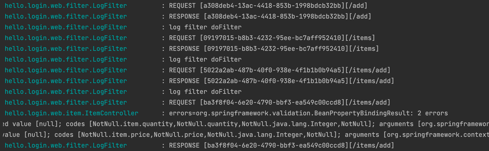
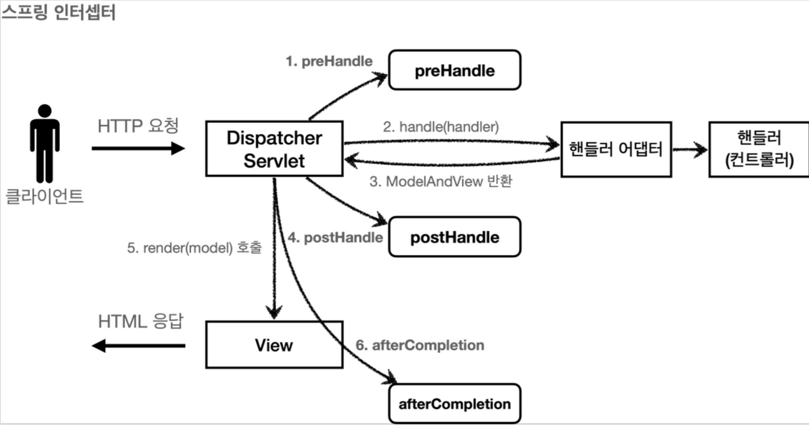
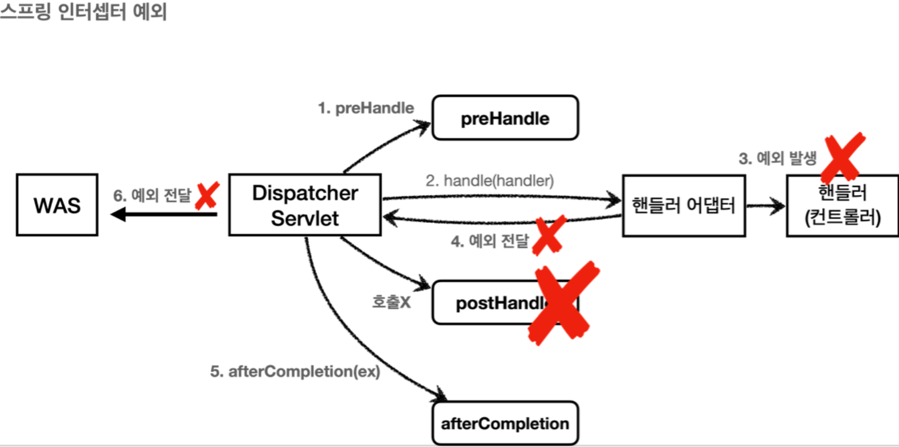
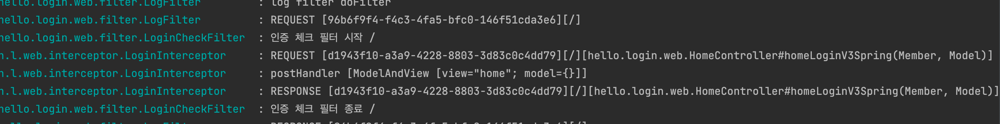

# 섹션 7. 로그인 처리2 - 필터, 인터셉터

## 서블릿 필터
#### 공통 관심 사항
로그인에 따라 등록, 수정, 삭제, 조회 등등 권한이 많이 달라진다. <br>
로그인 여부를 확인하는 곳은 여러 로직이다. 매번 같은 로직을 넣기엔 변경에 따라 수정할 곳도 많다. <br>

애플리케이션 여러 로직에서 로그인 같이 공통의 관심을 공통 관심사(cross-cutting concern)이라 한다.

공통 관심사를 처리하는 건 방법은 한두가지가 아니다. 하지만 웹과 관련된 공통 관심사는 서블릿과 인터셉터를 사용하는게 좋다. <br>
> **참고** <br>
> 웹과 관련된 공통 관심사는 HTTP 정보가 필요한데 <br>
> 서블릿 필터와 스프링 인터셉터는 HttpServletRequest를 제공한다. 


#### 서블릿 필터란?
필터는 서블릿이 지원하는 수문장이다. 필터의 특성은 다음과 같다.
                              
> **참고** <br>
> 스프링을 사용할 경우 서블릿은 디스패쳐 서블릿이다.

1. 필터의 흐름
```
HTTP 요청 -> WAS -> 필터 -> 서블릿 -> 컨트롤러
```

2. 필터 제한
```
HTTP 요청 -> WAS -> 필터 -> 서블릿 -> 컨트롤러 // 로그인 사용자
HTTP 요청 -> WAS -> 필터 (잘못된 요청, 서블릿 호출 X) // 비로그인 사용자
```
필터에서 잘못된 요청을 판단하여 곧바로 끝낼 수 있다. <br>
ex) 로그인 여부

3. 필터 체인
```
HTTP 요청 -> WAS -> 필터1 -> 필터2 -> 필터3 -> 서블릿 -> 컨트롤러
```
필터는 체인으로 구성되는데, 필터 여러개를 추가하고 순서까지 지정할 수 있다. <br>
ex) 로그 체크 -> 로그인 여부 체크

4. 필터 인터페이스
```
public interface Filter {
      public default void init(FilterConfig filterConfig) throws ServletException{}
      
      public void doFilter(ServletRequest request, ServletResponse response,
              FilterChain chain) throws IOException, ServletException;
      
      public default void destroy() {}
}
```
Filter 인터페이스를 구현하고 등록하면 서블릿 컨테이너가 싱글톤 객체로 생성하고 관리한다.
- init : 서블릿 컨테이너가 생성될 때 호출된다.
- doFilter : 요청이 올 때마다 호출되어 실행된다. 로직을 여기에 넣는다.
- destroy : 서블릿 컨테이너가 종료될 때 호출된다. 


## 서블릿 필터 - 요청 로그
필터를 이용한 요청 로그를 개발해보자.
```
@Slf4j
public class LogFilter implements Filter {

    @Override
    public void init(FilterConfig filterConfig) throws ServletException {
        log.info("log filter init");
    }

    @Override
    public void doFilter(ServletRequest request, ServletResponse response, FilterChain chain) throws IOException, ServletException {
        log.info("log filter doFilter");

        HttpServletRequest httpRequest = (HttpServletRequest)request;
        String requestURI = httpRequest.getRequestURI();
        String uuid = UUID.randomUUID().toString();

        try {
            log.info("REQUEST [{}][{}]", uuid, requestURI);
            chain.doFilter(request, response);
        } catch (Exception e) {
            throw e;
        } finally {
            log.info("RESPONSE [{}][{}]", uuid, requestURI);
        }
    }

    @Override
    public void destroy() {
        log.info("log filter destroy");
    }
}
```
Filter 인터페이스를 구현한다.
- doFilter(ServletRequest request, ServletResponse response, FilterChain chain)
  - HTTP 요청에 호출된다.
  - HTTP 가 아닌 경우를 고려하여 ServletRequest를 사용한다. HTTP 요청이면 다운캐스팅으로 HttpServletRequest 이용한다.
- chain.doFilter(request, response)
  - 필터가 존재하면 필터를 호출하는 로직이다. 필터가 없다면 서블릿이 호출된다.
  - 이 로직이 없으면 다음 단계로 넘어가지 않는다.


#### WebConfig - 필터 설정
만든 LogFilter를 적용해보자. <br>

스프링부트는 JavaConfig 방식이 일반적이다. <br>
FilterRegistrationBean를 이용해서 등록한다.
```
@Configuration
public class WebConfig {
    
    @Bean
    public FilterRegistrationBean logFilter() {
        FilterRegistrationBean<Filter> filterRegistrationBean = newFilterRegistrationBean<>();
        filterRegistrationBean.setFilter(new LogFilter());
        filterRegistrationBean.setOrder(1);
        filterRegistrationBean.addUrlPatterns("/*");
    
        return filterRegistrationBean;
    }
}
```
- setFilter() : 등록할 필터를 지정한다.
- setOrder : 필터는 체인으로 동작하기 떄문에 순서를 지정한다. 낮은 숫자가 먼저 실행된다.
- addUrlPatterns : 해당 필터를 적용할 URL를 지정한다.  

스프링이라면 web.xml를 통해 필터를 적용한다.
```
<filter>
    <filter-name>LogFilter</filter-name>
    <filter-class>hello.login.web.filter</filter-class>
</filter>

<filter-mapping>
    <filter-name>LogFilter</filter-name>
    <url-pattern>/*</url-pattern> <!-- 적용할 URL 패턴 -->
</filter-mapping>
```

필터가 동작하는지 아무 요청이나 해보자.



## 서블릿 필터 - 인증 체크
인증 체크 필터로 로그인 안한 사용자가 상품 관리에 접근 못하게 막아보자.
```
@Slf4j
public class LoginCheckFilter implements Filter {

    // init, destroy 는 구현안해도 됨.
    private static final String[] WHITE_LIST = {"/", "/members/add", "/login", "/logout", "/css/*"};

    @Override
    public void doFilter(ServletRequest request, ServletResponse response, FilterChain chain) throws IOException, ServletException {
        HttpServletRequest httpRequest = (HttpServletRequest) request;
        String requestURI = httpRequest.getRequestURI();

        HttpServletResponse httpResponse = (HttpServletResponse) response;

        try {
            log.info("인증 체크 필터 시작 {}", requestURI);
            if (isLoginCheckPath(requestURI)) {
                log.info("인증 체크 로직 실행 {}", requestURI);
                HttpSession session = httpRequest.getSession(false);

                if (session == null || session.getAttribute(SessionConst.LOGIN_MEMBER) == null) {
                    log.info("미인증 사용자 요청 {}", requestURI);

                    // 로그인으로 redirect
                    httpResponse.sendRedirect("/login?redirectURL="+requestURI);
                    return; // 미인증은 여기서 끝낸다.
                }
            };

            chain.doFilter(request, response);
        } catch (Exception e) {
            throw e; // 예외 로깅 가능한데, 톰캣까지 보내줘야함.
        } finally {
            log.info("인증 체크 필터 종료 {}", requestURI);
        }
    }

    /**
     * 화이트리스트의 경우 인증 체크 X
     */
    private boolean isLoginCheckPath(String requestURI) {
        return !PatternMatchUtils.simpleMatch(WHITE_LIST, requestURI);
    }
}
```
- 화이트리스트 : 인증에 상관없이 접근이 가능한 홈, 회원가입, 로그인 화면이나 css 리소스를 의미한다. 
- isLoginCheckPath(requestURI) : 요청 경로가 화이트 리스트가 아닌지 확인한다.
  - PatternMatchUtils 스프링프레임워크가 제공하는 유틸로 넘어온 값이 매칭하는게 있는지 알려준다.
- httpResponse.sendRedirect("/login?redirectURL="+requestURI) : 미인증 사용자를 로그인 화면으로 보낸다. <br>
  단, 로그인을 하면 다시 돌아올 수 있도록 redirectURL로 현재 경로를 보내준다.
- return : 아무것도 보내지 않는 이유는 미인증 사용자는 컨트롤러를 호출하면 안되기 때문이다. 대신 httpResponse.sendRedirect가 동작한다. 

#### WebConfig - loginCheckFilter 추가
필터 적용은 로그 필터와 같다. 
```
    @Bean
    public FilterRegistrationBean loginCheckFilter() {
        FilterRegistrationBean<Filter> filterRegistrationBean = new FilterRegistrationBean<>();
        filterRegistrationBean.setFilter(new LoginCheckFilter());
        filterRegistrationBean.setOrder(2);
        filterRegistrationBean.addUrlPatterns("/*");

        return filterRegistrationBean;
    }
```
로그 이후에 실행하기 때문에 순서는 2로 맞춘다.


#### RedirectURL 처리하기
인증에서 비로그인 사용자를 redirect하는 로직이 존재한다. 이를 받아서 로그인 후 되돌아가는 기능을 개발해보자.

```
@PostMapping("/login")
public String loginV4(@Valid @ModelAttribute LoginForm form, BindingResult bindingResult,
                      @RequestParam(defaultValue = "/") String redirectURL,
                      HttpServletRequest request) {
    if (bindingResult.hasErrors()) {
        return "login/loginForm";
    }

    Member loginMember = loginService.login(form.getLoginId(), form.getPassword());

    if (loginMember == null) {
        bindingResult.reject("loginFail", "아이디 또는 비밀번호가 다릅니다.");
        return "login/loginForm";
    }

    // 로그인 성공 처리
    // 세션이 있으면 반환, 없으면 신규 세션 생성해서 반환하면서 세션에 로그인 회원 보관
    request.getSession().setAttribute(SessionConst.LOGIN_MEMBER, loginMember);

    return "redirect:" + redirectURL;
}
```
로그인 로직은 간단히 수정하는 것으로 끝난다. <br>
필터에서 건네준 redirectURL를 받기 위해 @RequestParam(defaultValue = "/") String redirectURL를 추가하고 <br>
return "redirect:" + redirectURL 으로 로그인전 화면으로 되돌리면 끝난다. 


## 스프링 인터셉터 - 소개
스프링 인터셉터는 서블릿 필터와 같이 웹의 공통 관심 사항을 해결하는 기술이다. <br>
인터셉터는 스프링 MVC가 제공하는 기술이고 서블릿과 비슷하지만 적용 순서와 범위, 사용 방법이 다르다.

**1. 스프링 인터셉터 흐름**
```
HTTP 요청 -> WAS -> 필터 -> 서블릿 -> 스프링 인터셉터 -> 컨트롤러
```
- 스프링 인터셉터는 서블릿 다음에 호출된다.
- 스프링 MVC가 제공하다보니 결국엔 디스패처 서블릿 이후에 등장한다.
- URL 패턴은 서블릿과 다르면서 정밀하게 설정할 수 있다. 

**2. 스프링 인터셉터 제한**
```
HTTP 요청 -> WAS -> 필터 -> 서블릿 -> 스프링 인터셉터 -> 컨트롤러   // 로그인 사용자
HTTP 요청 -> WAS -> 필터 -> 서블릿 -> 스프링 인터셉터   // 비로그인 사용자
```
서블릿 필터처럼 적절하지 않은 요청은 그대로 종료한다. 

**3. 스프링 인터셉터 체인**
```
HTTP 요청 -> WAS -> 필터 -> 서블릿 -> 인터셉터1 -> 인터셉터2 -> 인터셉터3 -> 컨트롤러
```
서블릿 필터처럼 스프링 인터셉터도 체인으로 구성된다. 추가할 인터셉터의 실행 순서를 자유롭게 정할 수 있다.

스프링 인터셉터는 서블릿 필터와 비슷하지만, 더 정교하고 다양한 기능을 지원한다. 

#### 스프링 인터셉터 인터페이스
인터셉터를 이용하려면 HandlerInterceptor 인터페이스를 구현한다.

```
public interface HandlerInterceptor {

	default boolean preHandle(HttpServletRequest request, HttpServletResponse response, Object handler)
			throws Exception {

		return true;
	}
	
	default void postHandle(HttpServletRequest request, HttpServletResponse response, Object handler,
			@Nullable ModelAndView modelAndView) throws Exception {
	}
	
	default void afterCompletion(HttpServletRequest request, HttpServletResponse response, Object handler,
			@Nullable Exception ex) throws Exception {
	}

}
```
인터셉터는 단계적으로 세분화되어 있다.
- preHandle : 컨트롤러 호출전
- postHandle : 컨트롤러 호출 후
- afterCompletion : 요청 완료 이후

또한, 서블릿 필터는 request, response만 받았지만 <br>
인터셉터는 어떤 컨트롤러(handler)가 호출되는지 호출 정보와 어떤 ModelAndView가 반환 받는지 응답 정보도 받는다.


#### 스프링 인터셉터 흐름

위의 그림은 정상적인 흐름을 보여준다.

- preHandle : 컨트롤러 호출 전에 호출된다. (정확히는 핸들러 어댑터 호출 전에 호출됨.)
  - 응답값이 true면 다음으로 진행되고, false면 더 이상 진행안되고 그대로 종료한다.
- postHandle : 컨트롤러 호출 후에 호출된다. (정확히는 핸들러 어댑터 호출 후에 호출됨.)
- afterCompletion : 뷰가 렌더링 된 이후에 호출된다.  


#### 스프링 인터셉터 예외 상황

인터셉터 예외 흐름을 보여준다.

- preHandle : 예외인지 확인하면 false로 반환되고 흐름이 여기서 종료된다.
- postHandle : 호출되지 않는다.
- afterCompletion : 항상 호출된다. 예외를 파라미터로 받아서 어떤 예외인지 로그로 출력할 수 있다.

#### afterCompletion 예외가 발생해도 호출된다.
- 예외에 상관없는 공통처리를 하려면 postHandle이 아닌 afterCompletion를 사용해야한다.
- 예외가 발생하면 예외 정보를 포함해서 호출된다.

## 스프링 인터셉터 - 요청 로그
서블릿 필터로 개발했던 요청 로그를 인터셉터 버전으로 개발해보자.

```
@Slf4j
public class LoginInterceptor implements HandlerInterceptor {

    public static final String LOG_ID = "logId";

    @Override
    public boolean preHandle(HttpServletRequest request, HttpServletResponse response, Object handler) throws Exception {
        String requestURI = request.getRequestURI();
        String uuid = UUID.randomUUID().toString();

        request.setAttribute(LOG_ID, uuid);

        if (handler instanceof HandlerMethod) {
            // 호출할 컨트롤러 메서드의 모든 정보가 담겨있음.
            HandlerMethod hm = (HandlerMethod) handler;
        }

        log.info("REQUEST [{}][{}][{}]", uuid, requestURI, handler);
        return true;
    }

    @Override
    public void postHandle(HttpServletRequest request, HttpServletResponse response, Object handler, ModelAndView modelAndView) throws Exception {
        log.info("postHandler [{}]", modelAndView);
    }

    @Override
    public void afterCompletion(HttpServletRequest request, HttpServletResponse response, Object handler, Exception ex) throws Exception {
        String requestURI = request.getRequestURI();
        String logId = (String) request.getAttribute(LOG_ID);

        log.info("RESPONSE [{}][{}][{}]", logId, requestURI, handler);

        if (ex != null) {
            log.error("afterCompletion error!!", ex);
        }
    }
}
```
- UUID.randomUUID() : 서블릿 필터처럼 로그를 구분하기 위한 uuid 생성도 있다.
- request.setAttribute(LOG_ID, uuid) : 인터셉터는 호출 시점이 분리되어 있다 <br>
  preHandle, postHandle, afterCompletion에서 하나의 uuid를 사용하려면 어딘가에 담아야한다. <br>
  인터셉터도 싱글톤으로 관리되기 때문에 맴버변수는 매우 위험하다. request에 담아 활용한다.
- return true : 정상 호출로 처리해야 다음 인터셉터나 컨트롤러가 호출된다.

> **참고**
> 
> uuid를 request.setAttribute(LOG_ID, uuid)에 담아 활용했는데, 해당 식별자 다양한 요청에 겹치지 않게 주의하자.


#### HandleMethod
```
if (handler instanceof HandlerMethod) {
    HandlerMethod hm = (HandlerMethod) handler;
}
```
핸들러 정보는 어떤 핸들러 매핑을 사용하는가에 따라 달라진다. <br>
스프링은 일반적으로 @Controller, @RequestMapping 핸들러 매핑을 사용하는데, 이 경우 핸들러 정보로 HandlerMethod가 넘어온다. <br>
이 정보를 통해 어떤 컨트롤러의 메서드를 호출하는지 알 수가 있다.
```
String controllerName = hm.getBeanType().getSimpleName();  // 컨트롤러 이름
String methodName = hm.getMethod().getName();              // 메서드 이름
```

#### ResourceHttpRequestHandler
@Controller가 아니라 정적 리소스(/resource/static)가 호출되는 경우 ResourceHttpRequestHandler가 핸들러 정보로 넘어와서 타입에 따라 처리해야한다.

#### postHandle, afterCompletion
위의 코드를 보면 종료 로그를 afterCompletion에 선언했다. 그 이유는 postHandle이 예외에서 호출되지 않기 때문이다. <br>
afterCompletion는 예외에 상관없이 항상 호출된다.


#### 인터셉터 등록
인터셉터 등록은 WebMvcConfigurer 인터페이스의 addInterceptors를 구현한다.
```
@Configuration
public class WebConfig implements WebMvcConfigurer {

    @Override
    public void addInterceptors(InterceptorRegistry registry) {
        registry.addInterceptor(new LoginInterceptor())
                .order(1)
                .addPathPatterns("/**")
                .excludePathPatterns("/css/**", "/*.ico", "/error");
    }
}

```
- InterceptorRegistry : 스프링 MVC에서 인터셉터를 관리하는 클래스
- InterceptorRegistry.addInterceptor : 인터셉터를 등록
- order : 인터셉터의 호출 순서, 낮을 수록 먼저 호출됨.
- addPathPatterns : 인터셉터를 적용할 패턴
- excludePathPatterns : 인터셉터에서 제외할 패턴

서블릿 필터와 비교해보면 URL 패턴이 매우 단순해지는걸 볼 수 있다. <br>
스프링의 [URL 경로](https://docs.spring.io/spring-framework/docs/current/javadoc-api/org/springframework/web/util/pattern/PathPattern.html) 는 문서를 참고하자. 


> **참고사항** <br>
> WebMvcConfigurer는 뷰리졸버, 정적리소스, 인터셉터, 커스텀리졸버 등 스프링 MVC의 다양한 설정을 커스터마이징하고 확장하기 위한 인터페이스다.




## 스프링 인터셉터 - 인증 체크
서블릿 필터 인증에 비하면 인터셉터가 더욱 간결하게 개발이 가능하다.

```
@Slf4j
public class LoginCheckInterceptor implements HandlerInterceptor {

    @Override
    public boolean preHandle(HttpServletRequest request, HttpServletResponse response, Object handler) throws Exception {
        String requestURI = request.getRequestURI();

        log.info("인증 체크 인터셉터 실행 {}", requestURI);

        HttpSession session = request.getSession();

        if (session == null || session.getAttribute(SessionConst.LOGIN_MEMBER) == null) {
            log.info("미인증 사용자 요청");
            // 로그인으로 redirect
            response.sendRedirect("/login?redirectURL=" + requestURI);
            return false;
        }

        return true;
    }
}
```

인증 여부는 컨트롤러 호출전에만 확인하면 되는 것이기 때문에 preHandle만 구현하면 끝난다. <br>
HttpServletRequest 덕분에 매우 간결하게 구현이 되었다. <br> 
인증 체크 인터셉터 설정도 기존코드에 간단히 추가하면 된다.

```
    @Override
    public void addInterceptors(InterceptorRegistry registry) {
        registry.addInterceptor(new LoginInterceptor())
                .order(1)
                .addPathPatterns("/**")
                .excludePathPatterns("/css/**", "/*.ico", "/error");

        // LoginCheckInterception 만든 후
        registry.addInterceptor(new LoginCheckInterceptor())
                .order(2)
                .addPathPatterns("/**")
                .excludePathPatterns("/", "/members/add", "/login", "/logout",
                        "/css/**", "/*.ico", "/error");
    }
```
로그인을 확인안해도 되는 페이지는 excludePathPatterns에 경로만 추가하면 끝난다.


## ArgumentResolver 활용
로그인이 되어있다면 로그인 정보를 이용하거나, 없으면 사용안하는 기능이 꽤 존재한다. <br>
이 경우 ArgumentResolver를 이용해서 편리하게 사용할 수 있다.

```
    @GetMapping("/")
    public String homeLoginV3SpringArgumentResolver(@Login Member loginMember, Model model) {

        if (loginMember == null) {
            return "home";
        }

        model.addAttribute("member", loginMember);
        return "loginHome";
    }
```
@Login 애노테이션을 만들고 편리하게 로그인 정보를 찾아보자.

```

@Target(ElementType.PARAMETER)
@Retention(RetentionPolicy.RUNTIME)
public @interface Login {
}
```
@Login 애노테이션은 내부에 아무것도 구현하지 않는다. <br>

ArgumentResolver가 @Login를 인식할 수 있도록 HandlerMethodArgumentResolver를 구현한다.
```
@Slf4j
public class LoginMemberArgumentResolver implements HandlerMethodArgumentResolver {

    @Override
    public boolean supportsParameter(MethodParameter parameter) {
        log.info("supportsParameter 실행");

        boolean hasLoginAnnotion = parameter.hasParameterAnnotation(Login.class);
        boolean hasMemberType = Member.class.isAssignableFrom(parameter.getParameterType());

        return hasLoginAnnotion && hasMemberType;
    }

    @Override
    public Object resolveArgument(MethodParameter parameter, ModelAndViewContainer mavContainer,
                                  NativeWebRequest webRequest, WebDataBinderFactory binderFactory) throws Exception {

        log.info("resolveArgument 실행");
        HttpServletRequest request = (HttpServletRequest) webRequest.getNativeRequest();
        HttpSession session = request.getSession();

        if (session == null) {
            return null;
        }

        return session.getAttribute(SessionConst.LOGIN_MEMBER);
    }
}
```
- supportsParameter : ArgumentResolver의 요청을 처리할 수 있는지 구분해준다.
- resolveArgument : supportsParameter 결과가 true일 때 실행된다. @Login에 넣어줄 정보를 찾는다. 


