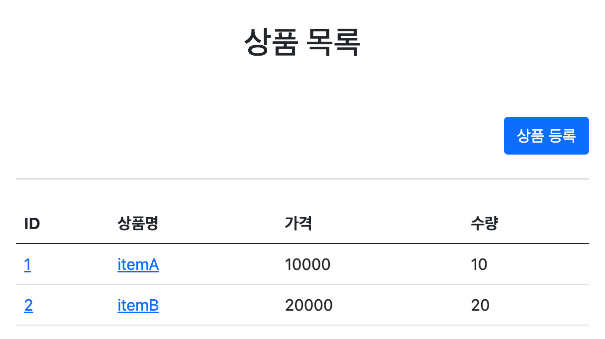

# 섹션 3. 메시지, 국제화 

## 프로젝트 세팅
- 이전 섹션2를 그대로 가져와서 재사용한다.
  - 일정부분 수정해서 시작해야하기 때문에 제공되는 소스에서 massege-start 폴더를 이용한다.
  - massege-start 폴더 이름을 massege 로 수정한다.


## 메시지, 국제화 소개
#### 메시지
일하다보면 명칭이나 문구를 수정해달라는 요청이 생긴다.
수정할 곳이 적으면 괜찮지만 수십, 수백개의 파일을 수정해야한다면?
이런 다양한 메시지를 한 곳에서 관리하는 것을 메시지 기능이라 한다.

메시지는 보통 properties 파일을 통해 관리된다.

##### messages.properties 파일
```
item=상품 
item.id=상품 ID 
item.itemName=상품명 
item.price=가격 
item.quantity=수량

page.addItem=상품 등록
...
```
타임리프는 이 메시지를 key 호출로 가져다 사용한다.
- 인텔리제이는 messages.properties 파일에 접근해서 목록을 보여주는 기능이 있다.

```
<label for="itemName" th:text="#{item.itemName}"></label>
```


#### 국제화
messages.properties를 나라별로 관리하여 서비스를 진행할 수 있다.

##### messages_en.properties 파일

``` 
item=Item 
item.id=Item ID 
item.itemName=Item Name
item.price=price
item.quantity=quantity
``` 

##### messages_ko.properties 파일
```
item=상품 
item.id=상품 ID 
item.itemName=상품명 
item.price=가격 
item.quantity=수량
```

- 이런 식으로 messages_xx.properties를 구분하면 사이트를 국제화할 수 있다.
- 어떤 언어인지 인식하는 방법은 HTTP accpet-language 헤더 값을 사용하거나, 사용자가 사이트에서 직접 언어를 선택해서 쿠키를 사용하면 된다.
  - 웹 브라우저별로 언어를 선택하는 기능이 제공된다. 
  - 언어를 찾지 못하면 default로 messages.properties를 찾는다. 


## 스프링 메시지 소스 설정
스프링은 기본적인 메시지 관리 기능을 제공한다.
메시지 기능을 활용하려면 메시지를 빈에 등록해야한다.
#### 자바에서 등록
```
@Bean
public MessageSource messageSource() {
    ResourceBundleMessageSource messageSource = new ResourceBundleMessageSource();
    messageSource.setBasenames("massage", "errors"); // 여러 파일명을 지정할 수 있음.
    messageSource.setDefaultEncoding("utf-8");
    return messageSource;
}
``` 
#### applicationContext.xml 에서 등록 
```
<bean id="messageSource" class="org.springframework.context.support.ResourceBundleMessageSource">
    <property name="basename" value="messages" />
    <property name="defaultEncoding" value="UTF-8" />
</bean>
```

#### 스프링부트 application.properties
```
spring.messages.basename=messages
```
- basename : 설정 파일명을 지정한다. 
  - messages로 지정하면 messages.properties 접근한다.
  - 국제화 경우 messages_en.properties, messages_ko.properties 등에 접근한다.
  - 메시지 파일의 위치는 /resources에 두면 된다.
  - 여러 파일명을 지정할 수 있다. 
  - 스프링부트에서는 기본적으로 제공한다. 위의 프로퍼티 선언을 생략하면 디폴트로 messages에 접근한다. 
    - messages.properties 파일을 만들면 자동적으로 접근함.
  - ,를 이용해서 여러 메시지 파일 등록이 가능하다
    - spring.messages.basename=messages,errors
      - 올바른 방법인지는 아직 모름.
    
#### 메시지 파일
메시지 파일은 키-값으로 구성된다.
- item=상품
- item.id=상품 ID 

## 스프링 메시지 소스 사용
``` 
@Autowired
MessageSource ms;

@Test
void helloMessage() {
    String result = ms.getMessage("hello", null, null); assertThat(result).isEqualTo("안녕");
}
```

#### 자바에서 메시지 사용
```
    @Autowired
    MessageSource ms;
  
    ... (생략) 
    String message = ms.getMessage("hello", null, null);   
```
- MessageSource 인터페이스를 이용하면 쉽게 메시지 사용할 수 있다.
  - getMessage(key, args, locale) 형태이며 메시지에 매개변수을 넣을 수 있는 경우 args에 노출시키고자 하는 값을 new Object[] 형태로 넣으면 된다.
    - new Object[]{"Spring"}
    - locale을 null로 넣을 경우엔 시스템의 기본 locale을 사용한다. 
```
hello=hello {0} 
```
- 메시지 목록에서 키를 찾을 수 없다면 NoSuchMessageException 예외가 발생한다.
  - 없을 경우 디폴트 문구를 지정해서 노출할 수 있다. getMessage(키, args, "못 찾으며 노출될 문구", locale)

#### 타임리프에서 메시지 사용
다음과 같은 메시지 파일이 있다.
```
label.item=상품
label.item.id=상품 ID
label.item.itemName=상품명
label.item.price=가격
label.item.quantity=수량
```

타임리프는 매우 단순하게 #{key}로 메시지를 사용할 수 있다.  
```
<div th:text="#{label.item}"></div>
```
렌더링되면 결과는 다음과 같다. 
<pre><code><div>상품</div></code></pre>

파라미터는 다음과 같이 사용한다.
```
hello.name=안녕 {0}
<p th:text="#{hello.name(${item.itemName})}"></p>
```

메시지를 사용하고자 하는 태그에 적용하면 끝난다. 


## 웹 애플리케이션에 국제화 적용
messages_en.properties 파일을 만들어주자
```
label.item=Item
label.item.id=Item ID
label.item.itemName=Item Name
label.item.price=price
label.item.quantity=quantity

page.items=Item List
page.item=Item Detail
page.addItem=Item Add
page.updateItem=Item Update

button.save=Save
button.cancel=Cancel
```
크롬으로 실행하면 크롬에서 선택된 언어로 메시지를 찾는다.


크롬 설정으로 들어가서 언어 우선순위를 영어로 바꾸고 새로고침해보자.


- 웹 브라우저는 언어 설정 변경 후 요청하면 Accept-Language 값도 변경된다.

#### 스프링의 국제화 메시지
- 메시지 기능은 Locale 정보를 알아야 언어 선택이 가능하다.
  - 스프링은 언어 선택 시 Accept-Language 헤더의 값을 기본으로 사용한다.

##### LocaleResolver
- 스프링이 언어를 선택할 수 있도록 LocaleResolver 인터페이스를 제공한다.
- 스프링 부트는 기본으로 Accept-Language를 활용하는 AcceptHeaderLocaleResolver를 사용한다.

##### LocaleResolver 인터페이스
```
public interface LocaleResolver {
	Locale resolveLocale(HttpServletRequest request);
	void setLocale(HttpServletRequest request, @Nullable HttpServletResponse response, @Nullable Locale locale);
}
```
- Locale 선택에 관한 커스터마이징이 필요하면 LocaleResolver의 구현체를 변경해서 세션이나 쿠키의 Locale 선택 기능을 사용할 수 있다.