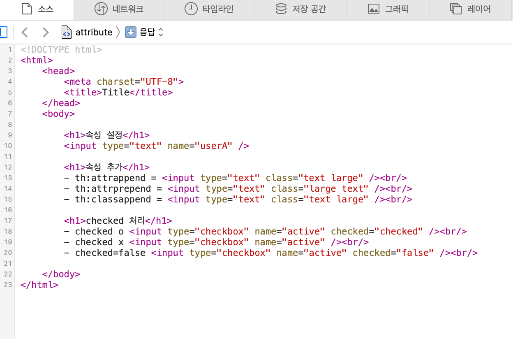

# 섹션 1. 타임리프 - 기본 기능

## 프로젝트 세팅
프로젝트 선택
- Project : Gradle - Groovy
- Language : Java
- Spring boot : 2.x

프로젝트 메타데이터
- Group : hello
- Artifact : thymeleaf-basic
- Name : thymeleaf-basic
- Package name : hello.thymeleaf
- Packaging : Jar
- Java : 11 

Dependencies
- Spring Web
- Lombok
- Thymeleaf

## 타임리프 특징
- 서버 사이드 HTML 렌더링 (SSR) : 백엔드 서버에서 HTML을 동적으로 렌더링 하는 용도로 사용
- 네츄럴 템플릿 : 순수 HTML을 유지하는 특징이 있다. 서버를 통해서 동적으로 렌더링하지 않아도 정상적인 HTML 결과를 볼 수 있다. 반대로 JSP는 순수 HTML을 유지하지않아서 JSP 소스코드와 HTML 코드가 뒤죽박죽 섞여있고 서버를 통해 렌더링해야 정상적인 HTML 결과를 볼 수 있다. 
- 스프링 통합 지원 : 스프링과 자연스럽게 통합되어 스프링의 다양한 기능을 지원받을 수 있다.


### 타임리프 기본 기능
#### 타임리프 사용 선언
아래처럼 선언을 해야 타임리프를 사용할 수 있따.
```<html xmlns:th="http://www.thymeleaf.org"/>```

#### 기본 표현식
타임리프가 제공하는 기본 표현식 목록이다.

- 간단한 표현
  - 변수 표현식: ${...}
  - 선택 변수 표현식: *{...}
  - 메시지 표현식: #{...}
  - 링크 URL 표현식: @{...}
  - 조각 표현식: ~{...}
- 리터럴
  - 텍스트: 'one text', 'Another one!',...
  - 숫자: 0, 34, 3.0, 12.3,...
  - 불린: true, false
  - 널: null
  - 리터럴 토큰: one, sometext, main,...
- 문자 연산:
  - 문자합치기:+
  - 리터럴 대체: |The name is ${name}|
- 산술 연산:
  - Binary operators: +, -, *, /, %
  - Minus sign (unary operator): -
- 불린 연산:
  - Binary operators: and, or
  - Boolean negation (unary operator): !, not
- 비교와 동등:
  - 비교:>,<,>=,<=(gt,lt,ge,le)
  - 동등 연산: ==, != (eq, ne)
- 조건 연산:
  - If-then: (if) ? (then)
  - If-then-else: (if) ? (then) : (else)
  - Default: (value) ?: (defaultvalue)
- 특별한 토큰:
  - No-Operation: _


## 텍스트 - text, utext
#### text
- 태그 값 교체
```<span th:text="${data}">내추럴<span/>```
  - data가 존재하면 '내추럴'이 data 값으로 변경된다.
  - 값이 없으면 내추럴이 그대로 노출됨.

- 컨텐츠에 직접 출력
```<span>[[${data}]]<span/>```
  - 이전과 다르게 값이 그대로 찍힌다.

#### utext
이전 text은 기본적으로 태그를 이스케이프하여 문자열로 만들어버린다.
이스케이프를 사용안하려면 2가지 방식이 있다.
- th:text -> th:utext로 변경한다.
- [[...]] -> [(...)]로 변경한다


## 변수 - SpringEL
지금까지 본 타임리프의 ${...} 변수 표현식은 스프링 EL을 사용할 수 있다.
```
class User {
  private String username;
  private int age;
  ... (생략)
}
```
```
  <h1>SpringEL 표현식</h1>
  
  <ul>Object 접근
      <li>${user.username} =    <span th:text="${user.username}"></span></li>
      <li>${user['username']} = <span th:text="${user['username']}"></span></li>
      <li>${user.getUsername()} = <span th:text="${user.getUsername()}"></span></li>
  </ul>
  
  <ul>List 접근
      <li>${users[0].username}    = <span th:text="${users[0].username}"></span></li>
      <li>${users[0]['username']} = <span th:text="${users[0]['username']}"></span></li>
      <li>${users[0].getUsername()} = <span th:text="${users[0].getUsername()}"></span></li>
  </ul>
  
  <ul>Map 접근
      <li>${userMap['userA'].username} =  <span th:text="${userMap['userA'].username}"></span></li>
      <li>${userMap['userA']['username']} = <span th:text="${userMap['userA']['username']}"></span></li>
      <li>${userMap['userA'].getUsername()} = <span th:text="${userMap['userA'].getUsername()}"></span></li>
  </ul>

  <h1>지역 변수 - (th:with)</h1>
  <!-- 지역변수는 선언 태그내에서만 사용할 수 있다. -->
  <div th:with="first=${users[0]}">
      <p>처음 사람의 이름은 <span th:text="${first.username}"></span></p>
  </div>
```  


## 기본 객체들
타임리프에는 다양한 기본 객체와 편의 객체를 제공하고 있다. 
컨트롤러에서 sessionData 이름으로 값을 넣어보자. 
```  
    @GetMapping("/basic-objects")
    public String basicObjects(HttpSession session) {
        session.setAttribute("sessionData", "hello session!");
        return "basic/basic-objects";
    }
```  
```
    <h1>식 기본 객체 (Expression Basic Objects)</h1>
    <ul>
        <li>request = <span th:text="${#request}"></span></li>
        <li>response = <span th:text="${#response}"></span></li>
        <li>session = <span th:text="${#session}"></span></li>
        <li>servletContext = <span th:text="${#servletContext}"></span></li>
        <li>locale = <span th:text="${#locale}"></span></li>
    </ul>
 
    <h1>편의 객체</h1>
    <ul>
        <li>Request Parameter = <span th:text="${param.paramData}"></span></li>
        <li>session = <span th:text="${session.sessionData}"></span></li>
        <li>spring bean = <span th:text="${@helloBean.hello('Spring!')}"></span></li>
    </ul>
```
- param 객체는 HTTP 요청 파라미터에 접근할 수 있다.
- 편의 객체의 마지막을 보면 ${@helloBean.hello('Spring!')가 있는데 타임리프에서 스프링 빈의 이름과 메서드(값)로 접근 할 수 있다. 

* 주의사항 스프링부트 3.0 이상부터는 기본 객체 ${#request}, ${#response}, ${#session}, ${#servletContext} 제공이 중단되어 위처럼 사용하려면
컨트롤러 코드를 다음과 같이 수정해야한다.
```  
    @GetMapping("/basic-objects")
    public String basicObjects(HttpSession session) {
        session.setAttribute("sessionData", "hello session!");
        model.addAttribute("request", request);
        model.addAttribute("response", response);
        model.addAttribute("servletContext", request.getServletContext());
        return "basic/basic-objects";
    }
```  


## 유틸리티 객체와 날짜
타임리프는 문자, 숫자, 날짜, URI 등 다양한 유틸리티 객체를 제공하고 있다.
```  
- #message : 메시지, 국제화 처리
- #uris : URI 이스케이프 지원
- #dates : java.util.Date 서식 지원 
- #calendars : java.util.Calendar 서식 지원 
- #temporals : 자바8 날짜 서식 지원
- #numbers : 숫자 서식 지원
- #strings : 문자 관련 편의 기능
- #objects : 객체 관련 기능 제공
- #bools : boolean 관련 기능 제공
- #arrays : 배열 관련 기능 제공
- #lists , #sets , #maps : 컬렉션 관련 기능 제공 #ids : 아이디 처리 관련 기능 제공, 뒤에서 설명
```  

우선 간단히 날짜를 지원하는 #temporals를 보고 넘어가자.


그 외에 자세한건 가이드문서를 참고하자.
- [타임리프 유틸리티 객체](https://www.thymeleaf.org/doc/tutorials/3.0/usingthymeleaf.html#expression-utility-objects)
- [유틸리티 객체 예시](https://www.thymeleaf.org/doc/tutorials/3.0/usingthymeleaf.html#appendix-b-expression-utility-objects)


## URL 링크
타임리프에서 url 링크는 @{...}를 사용한다
- 단순한 URL : ${/hello} -> /hello
- 쿼리 파라미터 : @{/hello(param1=${param1}, param2=${param2})} -> /hello?param1=data1&param2=data2
- 경로 변수 : @{/hello/{param1}/{param2}(param1=${param1}, param2=${param2})} -> /hello/data1/data2
- 경로 변수 + 쿼리 파라미터 : @{/hello/{param1}(param1=${param1}, param2=${param2})} -> /hello/data1?param2=data2
```  
  <h1>URL 링크</h1>
  <ul>
      <li><a th:href="@{/hello}">basic url</a></li>
      <li><a th:href="@{/hello(param1=${param1}, param2=${param2})}">hello query param</a></li>
      <li><a th:href="@{/hello/{param1}/{param2}(param1=${param1}, param2=${param2})}">path variable</a></li>
      <li><a th:href="@{/hello/{param1}(param1=${param1}, param2=${param2})}">path variable + query parameter</a></li>
  </ul> 
```  


참고로 절대 경로와 상대 경로도 표현할 수 있다
- 절대 경로 : /hello
- 상대 경로 : hello


## 리터럴
리터럴이란? 소스 코드상에 고정된 값을 말한다. (하드코딩이라 부르기도 한다.)

타임리프에서 리터럴 사용방법은 간단하다. 작은 따옴표로 '로 감싸면 된다. 
```  
<span th:text="'hello'"></span>
```  
감싸지 않으면 에러가 발생한다.
공백없이 이어진다면 문자열로 인식하지만 그냥 작은 따옴표를 쓰자.
```  
<li>'hello' + ' world!' = <span th:text="'hello' + ' world!'"></span></li>
<li>'hello world!' = <span th:text="'hello world!'"></span></li>
<li>'hello ' + ${data} = <span th:text="'hello ' + ${data}"></span></li>
<li>리터럴 대체 |hello ${data}| = <span th:text="|hello ${data}|"></span></li>
```  
마지막에 보면 작은 따옴표를 |로 대체해서 사용할 수 있다.


## 연산
타임리프에서 연산은 자바에서 별 차이 없다. (jsp의 JSTL과 흡사하다.)
```  
<ul>
  <li>산술 연산
      <ul>
          <li>10 + 2 = <span th:text="10 + 2"></span></li>
          <li>10 % 2 == 0 = <span th:text="10 % 2 == 0"></span></li>
      </ul>
  </li>
  <li>비교 연산
      <ul>
          <li>1 > 10 = <span th:text="1 &gt; 10"></span></li>
          <li>1 gt 10 = <span th:text="1 gt 10"></span></li>
          <li>1 >= 10 = <span th:text="1 >= 10"></span></li>
          <li>1 ge 10 = <span th:text="1 ge 10"></span></li>
          <li>1 == 10 = <span th:text="1 == 10"></span></li>
          <li>1 != 10 = <span th:text="1 != 10"></span></li>
      </ul>
  </li>
  <li>조건식
      <ul>
          <li>(10 % 2 == 0)? '짝수':'홀수' = <span th:text="(10 % 2 == 0)? '짝수':'홀수'"></span></li>
      </ul>
  </li>
  <li>Elvis 연산자 - 데이터 없을 때 사용함.
      <ul>
          <li>${data}?: '데이터가 없습니다.' = <span th:text="${data}?: '데이터가 없습니다.'"></span></li>
          <li>${nullData}?: '데이터가 없습니다.' = <span th:text="${nullData}?: '데이터가 없습니다.'"></span></li>
      </ul>
  </li>
  <li>No-Operation
      <ul>
          <li>${data}?: _ = <span th:text="${data}?: _">데이터가 없습니다.</span></li>
          <li>${nullData}?: _ = <span th:text="${nullData}?: _">데이터가 없습니다.</span></li>
      </ul>
  </li>
</ul>
```  


## 속성 값 설정
타임리프로 HTML 태그에 th:* 속성을 지정하는 방식으로 동작한다.

지정된 속성은 기존 속성을 대체하고, 기존 속성이 없으면 새로 만든다.
``` 
<h1>속성 설정</h1>
<input type="text" name="mock" th:name="userA" />

<h1>속성 추가</h1>
- th:attrappend = <input type="text" class="text" th:attrappend="class=' large'" /><br/>
- th:attrprepend = <input type="text" class="text" th:attrprepend="class='large '" /><br/>
- th:classappend = <input type="text" class="text" th:classappend="large" /><br/>

<h1>checked 처리</h1>
- checked o <input type="checkbox" name="active" th:checked="true" /><br/>
- checked x <input type="checkbox" name="active" th:checked="false" /><br/>
- checked=false <input type="checkbox" name="active" checked="false" /><br/>
``` 
- th:attreappend : 속성 값의 뒤에 값을 추가
- th:attrprepend : 속성 값의 앞에 값을 추가
- th:classappend : class 속성에 자연스럽게 추가

참고로 attreappend, attrprepend는 추가하는 위치에 따라 공백이 없으면 다른 속성과 그대로 이어지기 때문에 문제가 생길 수 있다
ex)  class="text" th:attrappend="class='large'" -> class="textlagre"
ex)  class="text" th:attrprepend는="class='large'" -> class="lagretext"




## 반복
반복은 th:each를 사용한다.
사용된 태그를 기준으로 해당 태그와 내부 태그를 반복적으로 그려간다.

- 반복 기능 th:each="user : ${users}" - users의 값을 하나씩 꺼내 user에 담아 사용한다. 자바의 foreach로 생각하면 편하다.
  - list 뿐만 아니라 배열, java.util.Iterable, java.util.Enumeration를 구현한 객체를 사용할 수 있다.
  - Map 도 사용되는데 이 경우 변수에 Map.entry가 담긴다.
  
- 반복 상태 유지 th:each="user, userStat : ${users}" - 두번째 파라미터(userStat)를 설정하면 반복의 상태를 확인할 수 있다.
  - 생략이 가능하며, 생략하면 디폴트로 지정된 변수명 (user) + (Stat) 으로 사용이 가능해진다. (userStat)
  - index : 0부터 시작하는 값
  - count : 1부터 시작하는 값
  - size : 전체 사이즈
  - even, odd : 홀짝 여부(boolean)
  - first, last : 처음, 마지막 여부(boolean)
  - curren : 현재 객체

``` 
<h1>기본 테이블</h1>
<table border="1">
    <tr>
        <th>username</th>
        <th>age</th>
    </tr>
    <tr th:each="user : ${users}">
        <td th:text="${user.username}">username</td>
        <td th:text="${user.age}">0</td>
    </tr>
</table>

<h1>반복 상태 유지</h1>
<table border="1">
    <tr>
        <th>count</th>
        <th>username</th>
        <th>age</th>
        <th>etc</th>
    </tr>
    <tr th:each="user, userStat : ${users}">
        <td th:text="${userStat.count}">count</td>
        <td th:text="${user.username}">username</td>
        <td th:text="${user.age}">0</td>
        <td>
            index = <span th:text="${userStat.index}"></span>
            count = <span th:text="${userStat.count}"></span>
            size = <span th:text="${userStat.size}"></span>
            even? = <span th:text="${userStat.even}"></span>
            odd? = <span th:text="${userStat.odd}"></span>
            first? = <span th:text="${userStat.first}"></span>
            last? = <span th:text="${userStat.last}"></span>
            current = <span th:text="${userStat.current}"></span>
        </td>
    </tr>
</table>
``` 


## 조건부
타임리프에는 다음과 같은 조건부가 있다. 조건에 해당되야 태그가 렌더링된다. 
- if : 참이면 실행한다. 
- unless : 거짓이면 실행한다. 
- swich : case별로 구분한다. 해당되는게 없으면 디폴트로 *이 실행된다. 

``` 
<body>
  <h1>if, unless</h1>
  <table border="1">
      <tr>
          <th>count</th>
          <th>username</th>
          <th>age</th>
      </tr>
      <tr th:each="user, userStat : ${users}">
          <td th:text="${userStat.count}">1</td>
          <td th:text="${user.username}">username</td>
          <td>
              <span th:text="${user.age}">0</span>
              <span th:text="'미성년자'" th:if="${user.age lt 20}"></span>
              <span th:text="'미성년자'" th:unless="${user.age ge 20}"></span>
          </td>
      </tr>
  </table>

  <h1>switch</h1>
  <table border="1">
      <tr>
          <th>count</th>
          <th>username</th>
          <th>age</th>
      </tr>
      <tr th:each="user, userStat : ${users}">
          <td th:text="${userStat.count}">1</td>
          <td th:text="${user.username}">username</td>
          <td th:switch="${user.age}">
              <span th:case="10">10살</span>
              <span th:case="20">20살</span>
              <span th:case="*">기타</span>
          </td>
      </tr>
  </table>
</body>
``` 


## 주석
타임리프엔 3가지 형태의 주석이 있다.
- 표준 HTML 주석 : 타임리프가 렌더링하지 않고 그대로 남긴다.
- 타임리프 파서 주석 : 타임리프의 주석으로 렌더링에서 주석부분을 삭제한다.
- 타임리프 프로토타입 주석 : 웹브라우저로 파일을 열면 해당 태그는 보이지 않는다, 타임리프 렌더링한 경우 보여준다. 
``` 
<h1>1. 표준 HTML 주석</h1>
<!--
<span th:text="${data}">html data</span> 
-->

<h1>2. 타임리프 파서 주석</h1> <!--/* [[${data}]] */-->
<!--/*-->
<span th:text="${data}">html data</span>
<!--*/-->
  
<h1>3. 타임리프 프로토타입 주석</h1>
<!--/*/
<span th:text="${data}">html data</span> 
/*/-->
``` 


## 블록
이전까지 사용된 타임리프 태그는 html 태그에 혼합되었는데
th:blcok 태그는 타임리프의 유일한 자체 태그다.
- 렌더링되면 block 태그는 삭제되고 내부의 태그만 남는다.
``` 
<th:block th:each="user : ${users}">
<div>
사용자 이름1 <span th:text="${user.username}"></span>
사용자 나이1 <span th:text="${user.age}"></span>
</div>

<div>
    요약 <span th:text="${user.username} + ' / ' + ${user.age}"></span>
</div>
</th:block>
```


## 자바스크립트 인라인
자바스크립트에서 편리하게 타임리프를 사용할 수 있는 기능을 제공한다.
```
    <!-- 자바스크립트 인라인 사용 전 -->
    <script>
        var username = [[${user.username}]];
        var age = [[${user.age}]];
        
        //자바스크립트 내추럴 템플릿
        var username2 = /*[[${user.username}]]*/ "test username";
        
        //객체
        var user = [[${user}]];
    </script>

    <!-- 자바스크립트 인라인 사용 후 -->
    <script th:inline="javascript">
        var username = [[${user.username}]];
        var age = [[${user.age}]];

        //자바스크립트 내추럴 템플릿
        var username2 = /*[[${user.username}]]*/ "test username";

        //객체 - json으로 넣어줌
        var user = [[${user}]];
    </script>

    <!-- 자바스크립트 인라인 each -->
    <script th:inline="javascript">

        [# th:each="user, stat : ${users}"]
        var user[[${stat.count}]] = [[${user}]];
        [/]
    </script>
```


- 인라인 미사용 : 자바스크립트에 어긋나는 케이스가 많다. 객체의 경우 toString()이 호출된다. 
- 인라인 사용 : 자바스크립트에 맞게 값이 출력되고 객체의 경우 json 형태로 반환된다. 
  - 중간에 username2의 경우 값이 없으면 "test username"이 사용되고, 값이 있으면 해당 값을 이용한다.
  - 값을 반복하는 경우엔 [# th:each=""] [/] 를 이용해서 세팅할 수 있다.

## 템플릿 조각
웹 페이지엔 공통 영역(헤더, 풋터 등)을 지원하기위해 템플릿 조각과 레이아웃 기능을 지원한다.
##### footer.html
```
<!DOCTYPE html>
<html xmlns:th="http://www.thymeleaf.org">
<body>

<footer th:fragment="copy"> 푸터 자리 입니다.</footer>

<footer th:fragment="copyParam (param1, param2)">
    <p>파라미터 자리 입니다.</p>
    <p th:text="${param1}"></p> <p th:text="${param2}"></p>
</footer>

</body>
</html>
```

##### main.html
```
<!DOCTYPE html>
<html xmlns:th="http://www.thymeleaf.org">
<head>
    <meta charset="UTF-8">
    <title>Title</title>
</head>
<body>
    <h1>부분 포함</h1>
    <h2>부분 포함 insert</h2>
    <div th:insert="~{template/fragment/footer :: copy}"></div>

    <h2>부분 포함 replace</h2>
    <div th:replace="~{template/fragment/footer :: copy}"></div>

    <h2>부분 포함 단순 표현식</h2>
    <div th:replace="template/fragment/footer :: copy"></div>

    <h1>파라미터 사용</h1>
    <div th:replace="~{template/fragment/footer :: copyParam ('데이터1', '데이터 2')}"></div>
</body>
</html>
```


- 템플릿 조각 호출 경로는 resources 폴더를 기준으로 삼는다.
  - ~{template/fragment/footer :: copy}
  - ~{template/fragment/footer :: copyParam('데이터1', '데이터2')} 

- footer.html을 보면 th:fragment 태그가 copy, copyParam(param1, param2) 2개로 구분된다.
  - copyParam처럼 템플릿 조각에 파라미터를 전달해서 동적으로 렌더링할 수 있다. 

- main.html를 보면 footer.html 전체가 아닌 지정된 th:fragment 태그만 가져오는 걸 알 수 있다.
- ~{...}로 지정하는 거와 ~{}를 생략하는게 있는데 템플릿 조각이 단순하면 생략해도 된다. 
- th:insert : 현재 태그 내부에 지정된 th:fragment 태그를 추가한다.
- th:replace : 현재 태그를 지정된 th:fragment 태그로 교체한다. 


## 템플릿 레이아웃1
코드 조각을 레이아웃에 넘겨서 사용해보자. head에 공통적으로 사용되는 css, js 예제다.
```
@GetMapping("/layout")
public String layout() {
  return "template/layout/layoutMain";
}
```
##### base.html
```
<html xmlns:th="http://www.thymeleaf.org">
<head th:fragment="common_header(title,links)">
    <title th:replace="${title}">레이아웃 타이틀</title>

    <!-- 공통 -->
    <link rel="stylesheet" type="text/css" media="all" th:href="@{/css/awesomeapp.css}">
    <link rel="shortcut icon" th:href="@{/images/favicon.ico}">
    <script type="text/javascript" th:src="@{/sh/scripts/codebase.js}"></script>

    <!-- 추가 -->
    <th:block th:replace="${links}" />
</head>
```
- 태그를 보면 th:replace 타임리프 태그가 있는데 common_header를 호출하는 곳에서 해당 태그를 보내준다는 의미다.  

##### layoutMain.html
```
<!DOCTYPE html>
<html xmlns:th="http://www.thymeleaf.org">
<head th:replace="template/layout/base :: common_header(~{::title},~{::link})">

    <title>메인 타이틀</title>

    <link rel="stylesheet" th:href="@{/css/bootstrap.min.css}">
    <link rel="stylesheet" th:href="@{/themes/smoothness/jquery-ui.css}">
</head>

<body>
메인 컨텐츠
</body>
</html>
```


- common_header(~{::title},~{::link})를 보면 ::title, ::link를 파라미터로 보낸다.
  - ::title은 title 태그들을 보낸다
  - ::link는 link 태그들을 보낸다. 
  - base.html에서 title, link 태그를 layoutMain.html이 보낸 태그로 치환한다. 
    - 공통부분은 그대로 유지되고 th:replace만 변경되었다.

## 템플릿 레이아웃2
이제는 html 전체로 템플릿을 확장해보자. 이전과 같은 방식이다.
```
@GetMapping("/layoutExtend")
public String layoutExtends() {
  return "template/layoutExtend/layoutExtendMain";
}
```
##### layoutFile.html
```
<!DOCTYPE html>
<html th:fragment="layout (title, content)" xmlns:th="http://
  www.thymeleaf.org">
<head>
    <title th:replace="${title}">레이아웃 타이틀</title>
</head>
<body>
    <h1>레이아웃 H1</h1>
    <div th:replace="${content}"> <p>레이아웃 컨텐츠</p> </div>
<footer>
    레이아웃 푸터
</footer>
</body>
</html>
```

##### layoutExtendMain.html
```
<html th:replace="~{template/layoutExtend/layoutFile :: layout(~{::title}, ~{::section})}"
      xmlns:th="http://www.thymeleaf.org">
<head>
    <title>메인 페이지 타이틀</title>
</head>
<body>
    <section>
        <p>메인 페이지 컨텐츠</p>
        <div>메인 페이지 포함 내용</div>
    </section>
</body>
</html>
```


- 이전처럼 layoutExtendMain 내용을 layoutFile에 보내서 치환한다.

