# 섹션 4. validation (검증)
 
## 검증 요구사항
상품 관리 시스템에 새로운 요구사항이 생겼다.

#### 요구 사항 : 검증 로직 추가
- 타입 검증
  - 가격, 수량에 문자가 들어가면 검증 오류 처리

- 필드 검증
    - 상품명 : 필수, 공백X
    - 가격 : 1,000원 이상 ~ 1,000,000원 이하
    - 수량 : 최대 9999
    
- 특정 필드의 범위를 넘어서는 검증
  - 가격 * 수량의 합은 10,000원 이상
  

이전까지 만든 웹 애플리케이션은 폼에 잘못된 값을 입력하면 오류화면으로 다시 되돌아간다. 
그런데 사용자는 뭐가 잘못된지 모르고 다시 처음부터 입력해야하는데 이런 서비스는 사용자가 이탈하는 원인이 된다.
웹 서비스는 오류가 발생하면 입력된 데이터를 유지하면서 고객에게 어떤 오류가 발생했는지 알려줘야한다.

**컨트롤러의 중요한 역할중 하나는 HTTP 요청이 정상인지 검증하는 것이다.**
이런 검증 로직 개발이 더 어려울 수 있다.
- 클라이언트 검증, 서버 검증
  - 클라이언트(브라우저) 검증은 조작 가능해서 취약하다.
  - 그렇다고 서버만으로 검증하면, 고객 사용성이 부족해진다.
  - 둘을 적절히 섞어서 사용하되, 최종적인 검증은 서버에서 한다.
  - API 방식을 사용하면 API 스펙을 잘 정의해서 검증 오류를 API 응답 결과에 잘 남겨준다.

## 프로젝트 설정 V1
제공되는 validation-start 폴더를 validation으로 변경해서 사용한다.


## 검증 직접 처리 - 소개
#### 상품 저장 성공
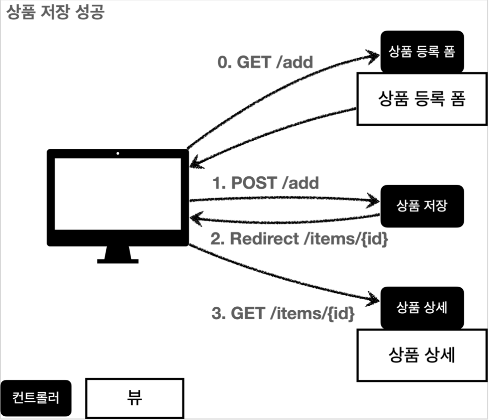
1. 사용자가 상품 등록 폼에서 정상적인 데이터를 입력하고 요청하면
2. 서버의 검증 로직을 통과하고
3. 상품을 저장하고
4. 상품 상세 화면으로 redirect 한다.

#### 상품 저장 실패
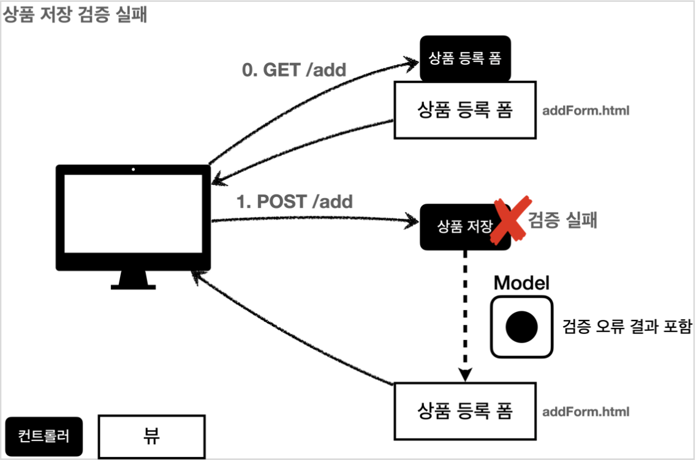
- 사용자가 공백이나 잘못된 데이터를 입력해서 요청하면, 서버 검증 로직이 실패해야 한다.
- 실패한 데이터를 다시 노출시켜주고 어디가 잘못되었는지 친절히 알려줘야한다.

## 검증 직접 처리 - 소개
#### addItem

```
@PostMapping("/add")
public String addItem(@ModelAttribute Item item, 
  RedirectAttributes redirectAttributes, Model model) {
  
  // 검증 오류 보관
  Map<String, String> errors = new HashMap<>();
  
  // 검증 로직
  if (!StringUtils.hasText(item.getItemName())) {
      errors.put("itemName", "상품 이름은 필수입니다.");
  }
  if (item.getPrice() == null || item.getPrice() < 1000 || item.getPrice() > 1000000) {
      errors.put("price", "가격은 1,000 ~ 1,000,000 까지만 가능합니다.");
  }
  if (item.getQuantity() == null || item.getQuantity() > 9999) {
      errors.put("quantity", "수량은 최대 9,999개 가능합니다.");
  }

  // 복합 룰 검증
  if (item.getPrice() != null && item.getQuantity() != null) {
      int resultPrice = item.getPrice() * item.getQuantity();
      if (resultPrice < 10000) {
          errors.put("globalError", "가격 * 수량의 합은 10,000원 이상이어야 합니다. 현재 값 = " + resultPrice);
      }
  }

  // 검증 실패하면 다시 입력폼으로 감.
  if (!errors.isEmpty()) {
      log.info("errors = {}", errors);
      model.addAttribute("errors", errors);
      return "validation/v1/addForm";
  }
  
  ... 정상적인 로직 ... 
}
```
- 요청온 데이터를 직접 하나하나 대조하면서 비교한다.
- 에러를 담을 errors 변수까지 관리한다. 
  - key는 필드명으로 넣는다. 
  - 상태 2개 이상을 검증하는 복합 룰은 glovalError key로 진행한다.
- 마지막으로 errors 변수에 값이 담겨져 있으면 입력폼으로 되돌린다.
  - 입력폼에 에러문구를 보여줄 타임리프 태그를 추가한다. 

#### addForm.html
```
<form action="item.html" th:action th:object="${item}" method="post">
  <div th:if="${errors?.containsKey('globalError')}">
    <p class="field-error" th:text="${errors['globalError']}">전체 오류 메시지</p> 
  </div>
  
  <div>
    <label for="itemName" th:text="#{label.item.itemName}">상품명</label>
    <input type="text" id="itemName" th:field="*{itemName}"
           th:class="${errors?.containsKey('itemName')} ? 'form-control field-error' : 'form-control'"
           class="form-control" placeholder="이름을 입력하세요">
    <div class="field-error" th:if="${errors?.containsKey('itemName')}" th:text="${errors['itemName']}">
        상품명 오류
    </div>
  </div>
  
  ... 개수, 가격 반복
```

>**참고사항** 
> errors.containsKey('globalError')를 사용했는데 조심해야한다.
> 사용자가 정상적인 데이터를 입력해서 에러문구가 안 담겨있으면 null이 발생한다.
> 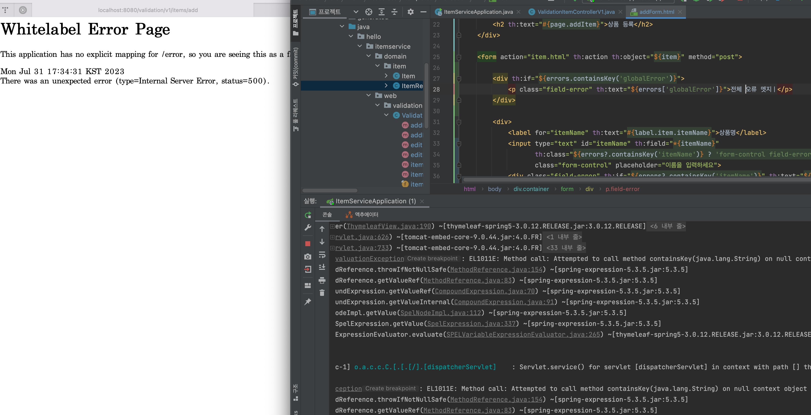
> 스프링에서는 이를 방지하기 위해 ?를 붙이는 기능을 재공한다. errors?.은 errors가 null일 때 널포인트익셉션대신 null을 반환하는 문법으로, th:if에서 null은 실패처리되어 오류 메시지는 노출되지 않는다.
> 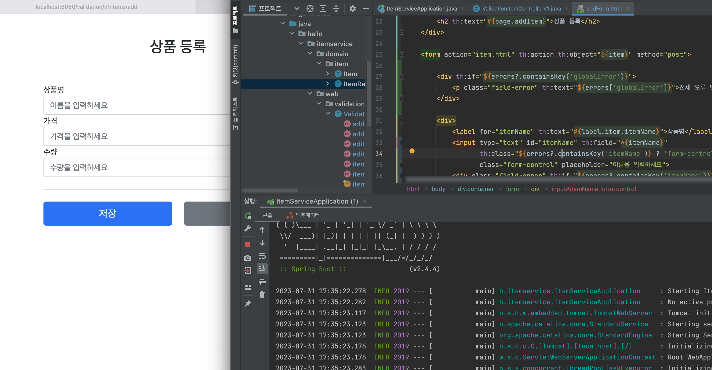
> 제사한 사항은 https://docs.spring.io/spring-framework/docs/current/reference/html/
core.html#expressions-operator-safe-navigation 를 참고하자.

#### 검증 실패
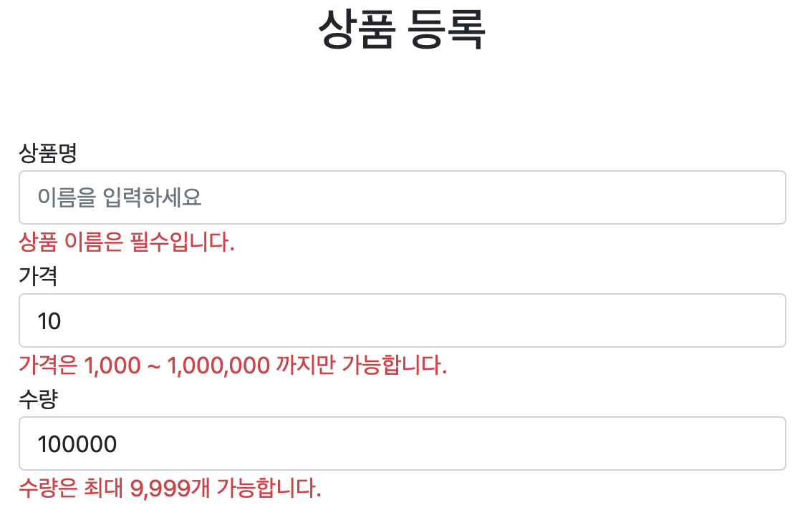

#### 문제점
- 뷰를 보면 단순하지만 반복되는 요소가 많다.
- 검증 실패 시, 사용자가 입력한 데이터가 노출되지 않는다.
- 타입 오류 처리가 안된다. 숫자에 문자를 입력하면 스프링MVC에서 컨트롤러에 진입하기전에 예외가 발생하기 때문에, 400 예외가 발생하면서 오류 페이지를 띄워준다.
- 

## BindingResult1
스프링이 제공하는 검증 오류 처리 방법은 BindResult를 이용하는 것이다.
- BindingResult : 스프링 프레임워크에서 데이터 바인딩과 폼 검증 결과를 저장하는 인터페이스 

```
@PostMapping("/add")
public String addItemV1(@ModelAttribute Item item, BindingResult bindingResult,
  RedirectAttributes redirectAttributes, Model model) {
  
  ...
  
```
>**주의**
> BindingResult bindingResult의 위치는 @ModelAttribute Item item 뒤에 와야한다. 

#### 필드 오류 - FieldError
```
// 검증 로직
if (!StringUtils.hasText(item.getItemName())) {
  bindingResult.addError(new FieldError("item", "itemName", "상품 이름은 필수입니다."));
}
if (item.getPrice() == null || item.getPrice() < 1000 || item.getPrice() > 1000000) {
  bindingResult.addError(new FieldError("item", "price", "가격은 1,000 ~ 1,000,000 까지만 가능합니다."));
}
if (item.getQuantity() == null || item.getQuantity() > 9999) {
  bindingResult.addError(new FieldError("item", "quantity", "수량은 최대 9,999개 가능합니다."));
}

```
- new FieldError(String objectName, String field, String defaultMessage)
  - objectName : @ModelAttribute 이름
  - field : 오류가 발생한 필드 이름
  - defaultMessage : 오류 기본 메시지

#### 글로벌 오류 - ObjectError
```
// 복합 룰 검증
if (item.getPrice() != null && item.getQuantity() != null) {
  int resultPrice = item.getPrice() * item.getQuantity();
  if (resultPrice < 10000) {
    bindingResult.addError(new ObjectError("item", "가격 * 수량의 합은 10,000원 이상이어야 합니다. 현재 값 = " + resultPrice));
  }
}
```
- new ObjectError(String objectName, String defaultMessage)
  - objectName : @ModelAttribute 이름
  - defaultMessage : 오류 기본 메시지

#### 타임리프 스프링 검증 오류 통합 기능
타임리프는 스프링의 BindingResult를 활용해서 검증 오류를 표현하는 기능을 제공한다.
```
<form action="item.html" th:action th:object="${item}" method="post">

  <div th:if="${#fields.hasGlobalErrors()}">
      <p class="field-error" th:each="err : ${#fields.globalErrors()}" th:text="${err}">글로벌 오류 메시지</p>
  </div>

  <div>
      <label for="itemName" th:text="#{label.item.itemName}">상품명</label>
      <input type="text" id="itemName" th:field="*{itemName}"
              th:errorclass="field-error" class="form-control" placeholder="이름을 입력하세요">
      <div class="field-error" th:errors="*{itemName}">
      </div>
  </div>
  <div>
      <label for="price" th:text="#{label.item.price}">가격</label>
      <input type="text" id="price" th:field="*{price}"
             th:errorclass="field-error" class="form-control" placeholder="가격을 입력하세요">
      <div class="field-error" th:errors="*{price}">
          가격 오류
      </div>
  </div>
  <div>
      <label for="quantity" th:text="#{label.item.quantity}">수량</label>
      <input type="text" id="quantity" th:field="*{quantity}"
             th:errorclass="field-error" class="form-control" placeholder="수량을 입력하세요">
      <div class="field-error" th:errors="*{quantity}">
          수량 오류
      </div>
  </div>

  ...
```
- **#fields** : #fields로 bindingResult가 제공하는 검증 오류에 접근
- **th:errors** : 해당 필드에 오류가 있는 경우에 태그르 출력, th:if 편의 버전이다.
- **th:errorclass** : th:field에서 지정한 필드에 오류가 있으면 class 정보를 추


## BindingResult2
- **BindingResult**는 스프링이 제공하는 검증 오류를 보관하는 객체다. 
- BindingResult가 있으면 @ModelAttribute에 데이터 바인딩 시 오류가 발생해도 컨트롤러가 호출된다.
  - BindingResult 없으면 - 400 오류 발생하면서 컨트롤러가 호출되지 않고 오류 페이지 노출
  - BindingResult 있으면 - 오류 정보(FieldError)를 BindingResult에 담아서 컨트롤러를 호출

#### 검증 오류를 적용하는 3가지 방법
- @ModelAttribute 객체의 타입 오류 등으로 바인딩이 실패하면 스프링이 FieldError를 생성해서 넣어준다.
- 개발자가 직접 넣어준다.
- Validator 사용

>**참고**
> BindingResult는 검증할 대상 바로 다음에 와야한다. 예를 들면 @ModelAttirubte Item item 다음에 와야한다.
> BindingResult는 Model에 자동으로 포함된다.

#### BindingResult와 Errors
<pre><code>
org.springframework.validation.Errors 
org.springframework.validation.BindingResult
</code></pre>

- BindingResult는 인터페이스고, Errors 인터페이스를 상속받는다.
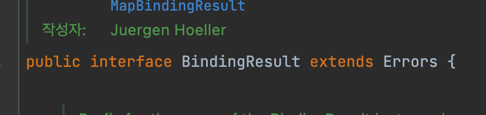
- 실제 넘어오는 구현체는 BeanPropertyBindingResult라는 것인데, 둘 다 구현하고 있으므로 BindingResult 대신에 Errors를 사용해도 된다.
- Errors 인터페이스는 단순 오류 저장과 조회 기능을 제공한다. BindingResult는 여기에 추가적인 기능들을 제공한다.
  - 주로 관례상 BindingResult를 많이 사용한다.

## FieldError, ObjectError
**FieldError**는 2가지 생성자를 제공한다.
```
if (!StringUtils.hasText(item.getItemName())) {
//  bindingResult.addError(new FieldError("item", "itemName", "상품 이름은 필수입니다."));
    bindingResult.addError(new FieldError("item", "itemName", item.getItemName(), false, null, null, "상품 이름은 필수입니다."));
}
```
```
public FieldError(String objectName, String field, String defaultMessage);

public FieldError(String objectName, String field, @Nullable Object rejectedValue, 
  boolean bindingFailure, @Nullable String[] codes, 
  @Nullable Object[] arguments, @Nullable String defaultMessage)
```
- objectName : 오류가 발생한 객체 이름
- field : 오류 필드
- rejectedValue : 사용자가 입력한 값(거절된 값)
- bindingFailure : 타입 오류가 바인딩 실패인지 검증 실패인지 구분
- codes : 메시지 코드
- arguments : 메시지에서 사용하는 인자
- defaultMessage : 기본 오류 메시지

사용자의 입력 데이터가 컨트롤러의 @ModelAttribute에 바인딩되는 시점에 오류가 발생하면 모델 객체에 사용자 입력 값을 유지하기 어렵다.
그래서 오류가 발생한 경우 사용자의 입력 값을 보관하는 별도의 방법이 필요하다. 이렇게 보관한 사용자 입력 값을 오류 시 화면에 다시 출력해준다.
**FieldError**는 오류 발생 시 사용자 입력 값을 저장하는 기능을 제공한다.

**FieldError** 생성자를 보면 사용자의 입력값을 저장하는 Object rejectedValue가 있다.
boolean bindingFailure는 타입 오류 여부를 적어주기 때문에 여기선 false를 넣었다.

**ObjectError**도 유사하게 2가지 생성자를 제공한다.
```
bindingResult.addError(new ObjectError("item", "가격 * 수량의 합은 10,000원 이상이어야 합니다. 현재 값 = " + resultPrice));
bindingResult.addError(new ObjectError("item", null, null,"가격 * 수량의 합은 10,000원 이상이어야 합니다. 현재 값 = " + resultPrice));
```
```
public ObjectError(String objectName, String defaultMessage);
public ObjectError(String objectName, @Nullable String[] codes, @Nullable Object[] arguments, @Nullable String defaultMessage);
```
- objectName : 오류가 발생한 객체 이름
- codes : 메시지 코드
- arguments : 메시지에서 사용하는 인자
- defaultMessage : 기본 오류 메시지

#### 타임리프의 사용자 입력 값 유지
addForm.html을 보면 다음과 같다. 
```
<label for="itemName" th:text="#{label.item.itemName}">상품명</label>
<input type="text" id="itemName" th:field="*{itemName}"
th:errorclass="field-error" class="form-control" placeholder="이름을 입력하세요">
<div class="field-error" th:errors="*{itemName}">
</div>
```
<pre><code>th:field=*{itemName}</code></pre>
타임리프의 th:field는 똑똑하게 동작하는데, 정상적인 상황에선 모델 객체의 값을 사용하지만,
오류가 발생하면 FieldError에서 보관한 값을 사용해서 값을 출력한다.
- th:field="*{itemName}" 정상 결과 : item 객체의 itemName 
- th:field="*{itemName}" 오류 결과 : bindingResult 객체에 있는 FieldError의 itemName


## 오류 코드와 메시지 처리1

```
public FieldError(String objectName, String field, @Nullable Object rejectedValue, 
  boolean bindingFailure, @Nullable String[] codes, 
  @Nullable Object[] arguments, @Nullable String defaultMessage)
```
```
public ObjectError(String objectName, @Nullable String[] codes, @Nullable Object[] arguments, @Nullable String defaultMessage);
```
- FieldError, ObjectError의 생성자는 codes, arguments를 제공한다. 이것은 오류 발생 시 오류 코드로 메시지를 찾기위해 사용된다.

#### errors 메시지 파일 생성
오류 메시지를 구분하기위해 errors.properties 별도의 파일을 생성한다.
##### errors.properties
```
#required.item.itemName=상품 이름은 필수입니다.
#range.item.price=가격은 {0} ~ {1} 까지 허용합니다.
#max.item.quantity=수량은 최대 {0} 까지 허용합니다.
#totalPriceMin=가격 * 수량의 합은 {0}원 이상이어야 합니다. 현재 값 = {1}
```

##### application.properties
errros 메시지 파일을 인식하기 위해 스프링부트 메시지 설정을 추가한다.
```
spring.messages.basename=messages,errors
```

기존 검증 로직에 에러 메시지를 인식하게 변경해보자. 
```
if (!StringUtils.hasText(item.getItemName())) {
  bindingResult.addError(new FieldError("item", "itemName", item.getItemName(), false, new String[]{"required.item.itemName", "default"}, null, null));
}
if (item.getPrice() == null || item.getPrice() < 1000 || item.getPrice() > 1000000) {
  bindingResult.addError(new FieldError("item", "price", item.getPrice(), false, new String[]{"range.item.price"}, new Object[]{1000, 1000000},null));
}
if (item.getQuantity() == null || item.getQuantity() > 9999) {
  bindingResult.addError(new FieldError("item", "quantity", item.getQuantity(), false, new String[]{"max.item.quantity"}, new Object[]{9999}, null));
}
```
- codes : 에러 메시지의 key를 지정한다. 배열 형태로 값을 받으며 먼저 적힌 key가 존재하면 출력한다.
- arguments : Object[]{값, 값} 형태로 사용해서 코드의 {0}, {1}로 치환할 값을 전달한다.

## 오류 코드와 메시지 처리2
이전까지 매번 반복되는 FieldError, ObjectError로 번거롭다.
BindingResult는 본인의 target을 알고 있다.
```
log.info("objectName={}", bindingResult.getObjectName()); // objectName=item, @ModelAttribute Name
log.info("target={}", bindingResult.getTarget()); // target=(id=null, itemName=상품, price=100, quantity=1234)
```


#### FieldError, ObjectError 단순화
bindingResult가 제공하는 rejectValue(), reject()를 이용하면 FieldError, ObjectError를 단순화 시킬 수 있다.

```
void rejectValue(@Nullable String field, String errorCode, @Nullable Object[] errorArgs, @Nullable String defaultMessage);
void reject(String errorCode, @Nullable Object[] errorArgs, @Nullable String defaultMessage)
```
- String field : 오류 필드명
- String errorCode : 오류 코드 (에러 메시지에 등록된 코드가 아니다. messageResolver를 통해 오류 코드를 찾아온다.)
- Object[] erorrArgs : 오류 메시지에서 {0}을 치환하기 위한 값
- String defaultMessage : 오류 메시지를 찾을 수 없으면 사용할 기본 메시지

```
if (!StringUtils.hasText(item.getItemName())) {
    bindingResult.rejectValue("itemName", "required");
}

if (item.getPrice() == null || item.getPrice() < 1000 || item.getPrice() > 1000000) {
    bindingResult.rejectValue("price", "range", new Object[]{1000, 1000000}, null);
}

if (item.getQuantity() == null || item.getQuantity() > 9999) {
    bindingResult.rejectValue("quantity", "max", new Object[]{9999}, null);
}

// 복합 룰 검증
if (item.getPrice() != null && item.getQuantity() != null) {
    int resultPrice = item.getPrice() * item.getQuantity();
    if (resultPrice < 10000) {
        bindingResult.reject("totalPriceMin", new Object[]{10000, resultPrice}, null);
    }
}
```
**축약된 오류 코드**
- FieldError는 오류 코드를 전부 입력했지만 rejectValue는 오류 코드를 전부 입력안해도 정상적인 에러 문구가 나오고 있다.
  - messageResolver가 오류 코드를 찾아준다.

## 오류 코드와 메시지 처리3
오류 코드는 자세하게 만들 수도 간단하게 만들 수도 있다.
```
required.item.itemName= 상품 이름은 필수입니다.
required= 필수 값 입니다.
```
단순하면 범용성이 좋아서 여러곳에서 사용할 수 있지만, 세밀하게 작성하기 어렵다.
세밀하면 범용성이 떨어지고 한 곳에서 사용할 수 밖에 없다.
가장 좋은 방법은 범용성 있게 사용하다가, 세밀한 내용이 필요할 때 적용할 수 있도록 메시지에 단계를 두는 것이다.
```
#Level1
required.item.itemName= 상품 이름은 필수입니다.

#Level2
required= 필수 값 입니다.
```
위와 같이 범용성과 세밀한 메시지 required, required.item.itemName 2개가 있다.
간단히 오류 코드로 required를 사용한다면 required에 해당되는 메시지를 사용할 거 같지만.
required.item.itemName 같이 객체와 필드명이 조합된 세밀한 메시지가 있다면 높은 우선순위로 세밀한 메시지를 사용한다.

스프링의 MessageCodeResolver는 이러한 기능을 지원한다.


## 오류 코드와 메시지 처리4
#### MessageCodesResolver
검증 오류 코드로 메시지 코드들을 생성한다.
- MessageCodeResolver 인터페이스고, DefaultMessageCodesResolver는 기본 구현체다.
- 주로 ObjectError, FieldError와 함께 사용한다.
```
public class MessageCodesResolverTest {

    MessageCodesResolver codesResolver = new DefaultMessageCodesResolver();
    
    @Test
    void messageCodeResolverObject() throws Exception {
        
        String[] messageCodes = codesResolver.resolveMessageCodes("required", "item");

        assertThat(messageCodes).contains("required.item", "required");
    }
    
    
    @Test
    void messageCodeResolverField() throws Exception {
        String[] messageCodes = codesResolver.resolveMessageCodes("required", "item", "itemName", String.class);

        assertThat(messageCodes).containsExactly(
                "required.item.itemName",
                "required.itemName",
                "required.java.lang.String",
                "required"
                );
    }
}
```

#### DefaultMessageCodesResolver 의 코드 생성 규칙
**객체 오류**는 다음 순서로 2가지 생성한다. 
2. code + "." + object name
3. code

예) 오류 코드 : required, object name : item
1. required.item
2. required

**필드 오류**는 다음 순서로 4가지 생성한다.
1. code + "." + object name + "." + field
2. code + "." + field
3. code + "." + field type
4. code

예) 오류 코드 : typeMismatch, object name : "user", field : "age", type : int
1. typeMismatch.user.age
2. typeMismatch.age
3. typeMismatch.int
4. typeMismatch
 
자세한 사항은 MessageCodeResolver 인터페이스의 구현체인 DefaultMessageCodesResolver에 자세히 나와있다.
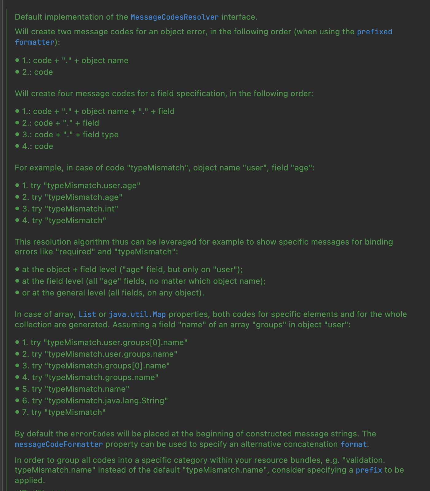
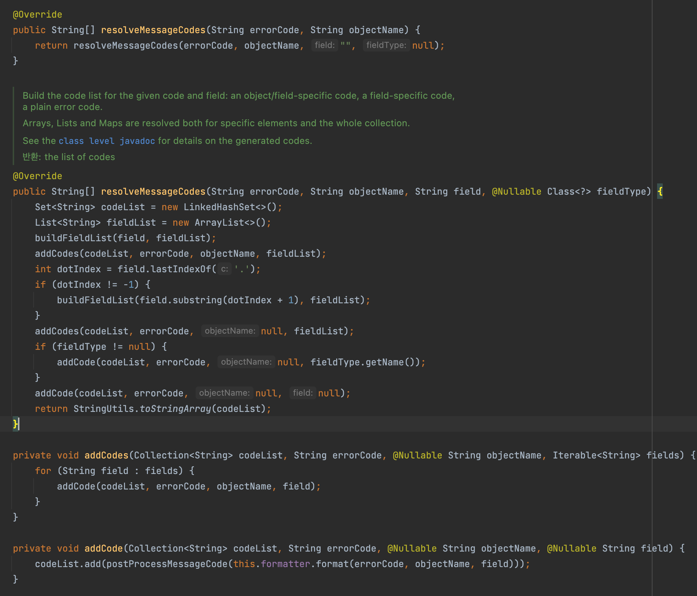

#### 동작 방식
- rejectValue(), reject()는 내부에서 MessageCodeResolver를 사용한다.
- FieldError, ObjectError 생성자를 보면 오류 코드를 여러개 가질 수 있다. MessageCodeResolver를 통해서 생성된 순서대로 오류 코드를 보관한다.
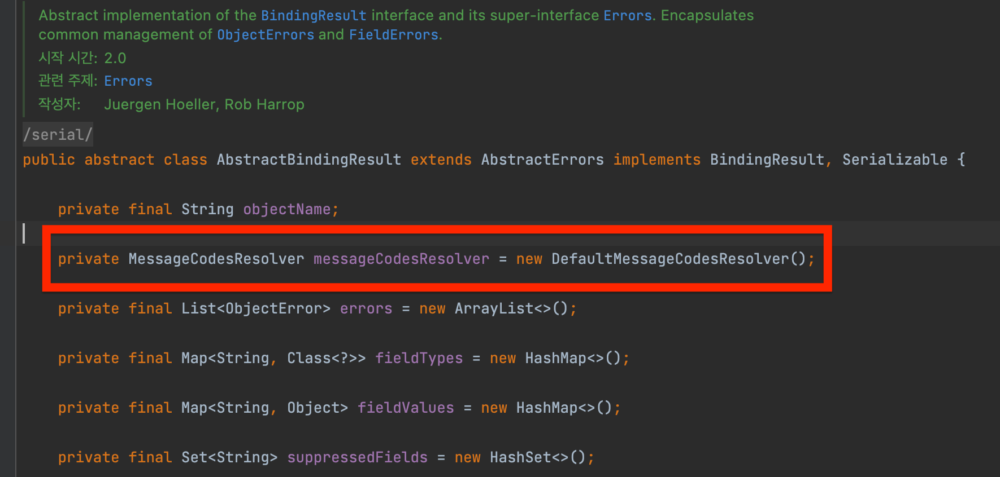
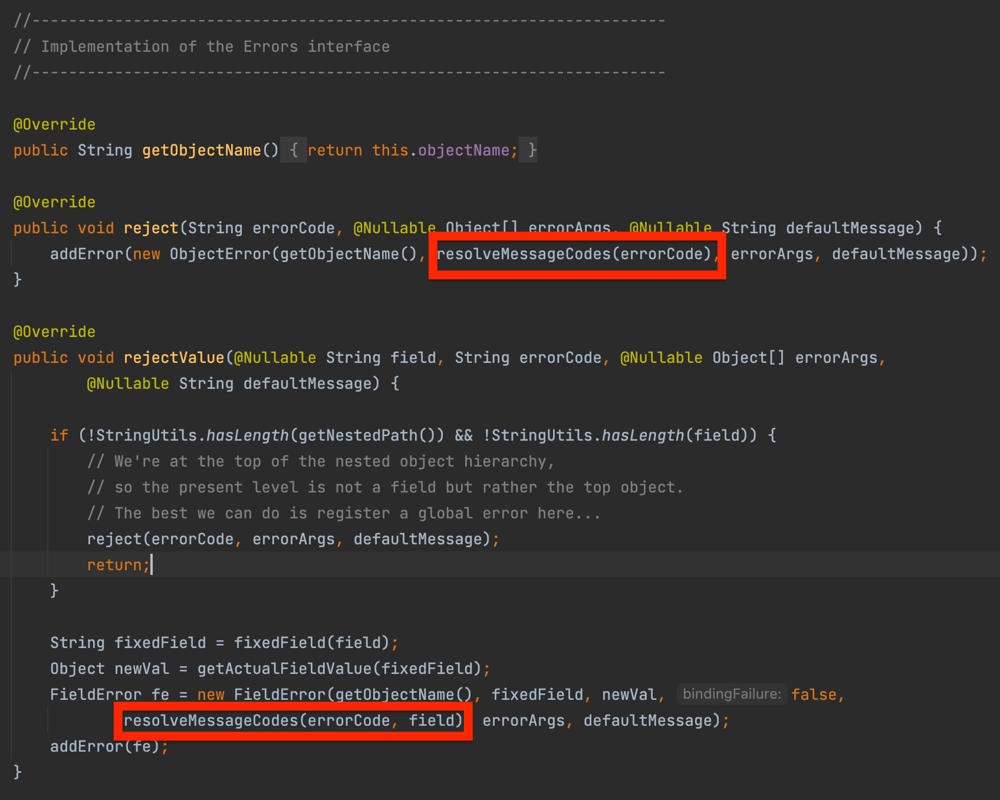

#### 오류 메시지 출력
타임리프 화면을 렌더링할 때 th:erorrs가 실행된다. 이 때 오류가 있다면 생성된 오류 코드를 순서대로 돌아가면서 메시지를 찾는다. 없으면 디폴트 메시지를 출력한다.
```
// 오류코드 순서대로 찾는다. 
codes [required.item.itemName,required.itemName,required.java.lang.String,required]
```

## 오류 코드와 메시지 처리5

#### 오류 코드 관리 전략
**핵심은 구체적인 것에서 덜 구체적인 것으로**
MessageCodeResolver는 required.item.itemName처럼 구체적인 오류 코드를 먼저 만들고, required처럼 덜 구체적인 것을 마지막에 만든다.
```
@Override
public String[] resolveMessageCodes(String errorCode, String objectName, String field, @Nullable Class<?> fieldType) {
    Set<String> codeList = new LinkedHashSet<>();
    List<String> fieldList = new ArrayList<>();
    buildFieldList(field, fieldList);
    // 첫번째, 가장 구체적인 오류 코드
    addCodes(codeList, errorCode, objectName, fieldList);
    int dotIndex = field.lastIndexOf('.');
    if (dotIndex != -1) {
        buildFieldList(field.substring(dotIndex + 1), fieldList);
    }
    // 두번쨰, 구체적인 오류 코드
    addCodes(codeList, errorCode, null, fieldList);
    if (fieldType != null) {
        // 세번째, 덜 구체적인 오류 코드  
        addCode(codeList, errorCode, null, fieldType.getName());
    }
    // 마지막, 가장 단순한 오류 코드
    addCode(codeList, errorCode, null, null);
    return StringUtils.toStringArray(codeList);
}
```
이를 활용하면 공통 전략을 편리하게 사용할 수 있다.

**오류 코드 전략을 왜 이렇게 복잡하게?**
모든 오류 코드를 각각 다 정의하는 건 매우 복잡하고 개발자가 관리하기 힘들다.
중요하지 않은 케이스에 대해선 범용성 있는 required를 사용하고, 중요한 메시지는 필요할 때 구체적으로 적어서 사용하는 방식이 더 효과적이다.

```
#==ObjectError==
#Level1
totalPriceMin.item=상품의 가격 * 수량의 합은 {0}원 이상이어야 합니다. 현재 값 = {1}

#Level2 - 생략
totalPriceMin=전체 가격은 {0}원 이상이어야 합니다. 현재 값 = {1}

#==FieldError==
#Level1
required.item.itemName=상품 이름은 필수입니다.
range.item.price=가격은 {0} ~ {1} 까지 허용합니다.
max.item.quantity=수량은 최대 {0} 까지 허용합니다.

#Level2 - 생략

#Level3
required.java.lang.String = 필수 문자입니다.
required.java.lang.Integer = 필수 숫자입니다.
min.java.lang.String = {0} 이상의 문자를 입력해주세요.
min.java.lang.Integer = {0} 이상의 숫자를 입력해주세요.
range.java.lang.String = {0} ~ {1} 까지의 문자를 입력해주세요.
range.java.lang.Integer = {0} ~ {1} 까지의 숫자를 입력해주세요.
max.java.lang.String = {0} 까지의 문자를 허용합니다.
max.java.lang.Integer = {0} 까지의 숫자를 허용합니다.

#Level4
required = 필수 값 입니다.
min= {0} 이상이어야 합니다.
range= {0} ~ {1} 범위를 허용합니다. max= {0} 까지 허용합니다.
```
오류 코드 생성 규칙에 따라 만든 Level 1 ~ Level 4 메시지다.

#### ValidationUtils
초창기 검증 로직을 계속 개선되었지만, 아직도 반복되는 코드가 많다.
```
ValidationUtils.rejectIfEmptyOrWhitespace(bindingResult, "itemName", "required");
if (!StringUtils.hasText(item.getItemName())) {
    bindingResult.rejectValue("itemName", "required");
}
if (item.getPrice() == null || item.getPrice() < 1000 || item.getPrice() > 1000000) {
    bindingResult.rejectValue("price", "range", new Object[]{1000, 1000000}, null);
}
if (item.getQuantity() == null || item.getQuantity() > 9999) {
    bindingResult.rejectValue("quantity", "max", new Object[]{9999}, null);
}
```
객체의 상태를 수동으로 확인하고 직접 에러를 추가한다.
이를 ValidationUtils로 간단하게 개선할 수 있다.
```
ValidationUtils.rejectIfEmptyOrWhitespace(bindingResult, "itemName", "required");
// if (!StringUtils.hasText(item.getItemName())) {
//     bindingResult.rejectValue("itemName", "required");
// }
```
하지만 ValidationUtils은 empty 공백 기능만 제공해서 다른 케이스에 대해 사용할 수 없다.

## 오류 코드와 메시지 처리 6
#### 스프링이 직접 만든 오류 메시지 처리
검증 오류 코드는 2가지로 나눌 수 있다.
- 개발자가 직접 설정한 오류 코드 rejectValue(), reject()를 직접 호출
- 스프링이 직접 검증 오류에 추가한 경(타입 오류)
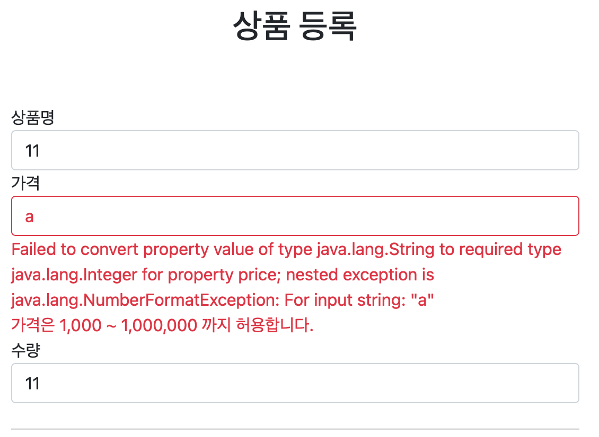

입력폼에 숫자 대신 문자열을 입력하면 typeMisamtch 타입 오류가 발생한다.
타입 오류가 발생하면 스프링이 typeMismatch 오류 코드를 사용하고 MessageCodesResolver를 통해 4가 메시지 코드가 생성된다.
```
Field error in object 'item' on field 'price': rejected value [a]; codes [typeMismatch.item.price,typeMismatch.price,typeMismatch.java.lang.Integer,typeMismatch];
```
사용자에게 날 것의 에러 문구가 노출되고 있는데, 이 타입 오류에 해당되는 메시지도 errors.property에 추가하면 대체가 된다.
```
#타입 오류 추가
typeMismatch.java.lang.Integer=숫자를 입력해주세요
typeMismatch=타입 오류입니다.
```
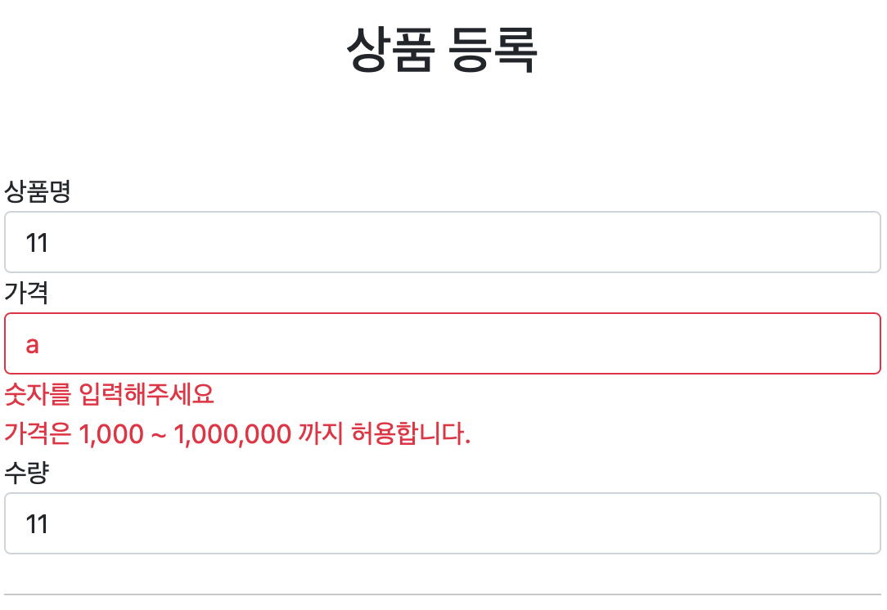
**메시지 코드 생성 전략은 그냥 만들어진 것이 아니다.**

## Validator 분리 1
지금까지 검증 로직을 컨트롤러에 구현했는데, 로직이 차지하는 부분이 매우 크다. 이런 경우 별도의 클래스로 역할을 분리하는 것이 좋다.
- 분리하면 재사용이 용이해진다.

```
@Component
public class ItemValidator implements Validator {
    @Override
    public boolean supports(Class<?> clazz) {
        return Item.class.isAssignableFrom(clazz);
    }

    @Override
    public void validate(Object target, Errors errors) {
        Item item = (Item) target;

        if (!StringUtils.hasText(item.getItemName())) {
            errors.rejectValue("itemName", "required");
        }

        if (item.getPrice() == null || item.getPrice() < 1000 || item.getPrice() > 1000000) {
            errors.rejectValue("price", "range", new Object[]{1000, 1000000}, null);
        }

        if (item.getQuantity() == null || item.getQuantity() > 9999) {
            errors.rejectValue("quantity", "max", new Object[]{9999}, null);
        }

        // 복합 룰 검증
        if (item.getPrice() != null && item.getQuantity() != null) {
            int resultPrice = item.getPrice() * item.getQuantity();
            if (resultPrice < 10000) {
                errors.reject("totalPriceMin", new Object[]{10000, resultPrice}, null);
            }
        }
    }
}
```
Validator는 스프링이 검증을 위해 제공하는 인터페이스다.
```
public interface Validator {
    boolean supports(Class<?> clazz);
    void validate(Object target, Errors errors);
}
```
- supports() : 해당 검증기를 지원하는 여부
- validate() : 검증 대상 객체와 BindingResult

#### Validator 호출하기
##### 직접 호출
```
...
public class ValidationItemControllerV2 {
    
    private final ItemValidator itemValidator;
  
    @PostMapping("/add")
    public String addItemV5(@ModelAttribute Item item, BindingResult bindingResult,
                            RedirectAttributes redirectAttributes, Model model) {
    
        itemValidator.validate(item, bindingResult);
    
        if (bindingResult.hasErrors()) {
            log.info("errors = {}", bindingResult);
            return "validation/v2/addForm";
        }
    
        Item savedItem = itemRepository.save(item);
        redirectAttributes.addAttribute("itemId", savedItem.getId());
        redirectAttributes.addAttribute("status", true);
        return "redirect:/validation/v2/items/{itemId}";
    }
}
```
직접 호출은 사용하고 싶은 곳에서 직접 호출하면 된다.

##### WebDataBinder 통해 호출
스프링이 Validator 인터페이스를 별도로 제공하는 이유는 체계적인 검증을 위해서다.
이 인터페이스는 이전까지 직접 사용했지만, 스프링의 추가적인 도움을 받아 사용할 수 있다.

WebDataBinder는 스프링의 파라미터 바인딩의 역할을 해주고 검증 기능도 내부에 포함된다.
```
...
public class ValidationItemControllerV2 {

    private final ItemRepository itemRepository;
    private final ItemValidator itemValidator;

    @InitBinder
    public void init(WebDataBinder dataBinder) {
        dataBinder.addValidators(itemValidator);
    }
    ...
```
@InitBinder를 추가하면 해당 컨트롤러는 검증기를 자동으로 사용할 수 있다.

## Validator 분리 2

#### @Validated 적용
```
    @PostMapping("/add")
    public String addItemV6(@Validated @ModelAttribute Item item, BindingResult bindingResult,
                            RedirectAttributes redirectAttributes, Model model) {

        if (bindingResult.hasErrors()) {
            log.info("errors = {}", bindingResult);
            return "validation/v2/addForm";
        }

        Item savedItem = itemRepository.save(item);
        redirectAttributes.addAttribute("itemId", savedItem.getId());
        redirectAttributes.addAttribute("status", true);
        return "redirect:/validation/v2/items/{itemId}";
    }
```
이전까지의 검증 로직은 모두 없어지고 검증 대상 앞에 @Validated 어노테이션이 붙는다. 정상적으로 동작하는걸 볼 수 있다.

#### 동작 방식
@Validated는 검증기를 실행하라는 어노테이션이다.
이 어노테이션이 붙으면 WebDataBinder에 등록한 검증기를 찾아서 실행한다.
여러 검증기가 존재한다면 supports()를 통해 사용될 검증기를 찾는다.
```
@Override
public boolean supports(Class<?> clazz) {
    return Item.class.isAssignableFrom(clazz);
    /*
        isAssignableFrom를 사용하면 자식까지 확인해줌.
        item == clazz
        item == subItem
    */
}
```
supports를 통과한다면 해당 검증기의 validate()가 실행된다. 

#### 글로벌 설정 - 모든 컨트롤러에 다 적용.
이전에 해당 컨트롤러에만 적용하는 @InitBinder를 보았는데,
모든 컨트롤러에 적용하는 방법이 있다. @SpringBootApplication에서 설정을 한다. 
```
@SpringBootApplication
public class ItemServiceApplication mplements WebMvcConfigurer {

	public static void main(String[] args) {
		SpringApplication.run(ItemServiceApplication.class, args);
	}

	@Override
	public Validator getValidator() {
		return new ItemValidator();
	}
}
```
> **주의**
> 
> 글로벌 설정을 직접 사용하는 경우는 드물다.

> **참고**
> 
> 검증 시 @Validated, @Valid 둘 다 사용이 가능하다.
> javax.validation.@Valid 를 사용하려면 build.gradle 의존관계 추가가 필요하다.
> 
> implementation 'org.springframework.boot:spring-boot-starter-validation'
> 
> @Validated는 스프링 전용 애노테이션이고,
> 
> @Valid는 자바 표준 애노테이션이다.


